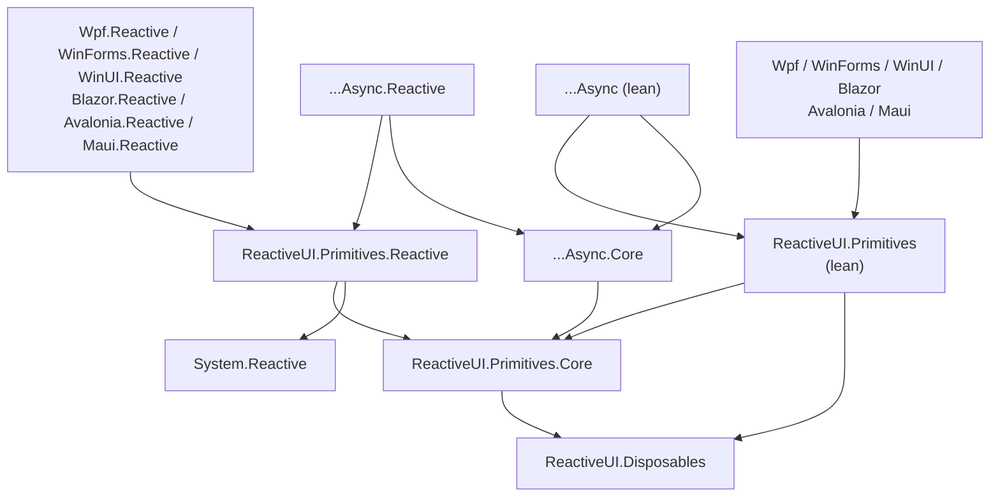

[](https://www.nuget.org/packages/ReactiveUI.Primitives) [](https://github.com/reactiveui/Primitives/actions/workflows/ci-build.yml) [](https://codecov.io/gh/reactiveui/Primitives) [](https://reactiveui.net/contribute)
<br>
<a href="https://www.nuget.org/packages/ReactiveUI.Primitives">

</a>
<a href="https://reactiveui.net/slack">

</a>


# ReactiveUI.Primitives

ReactiveUI.Primitives is a small, fast library for reactive programming in .NET. Reactive programming means working
with values that arrive over time, such as button clicks, timer ticks, or network replies, rather than values you
already hold.

If you know LINQ, you already know the shape. LINQ queries a collection you already hold and pulls values out of an
`IEnumerable<T>`. Reactive programming queries values that arrive over time: an `IObservable<T>` pushes each value to
you as it happens. The operators carry over, so `Select`, `Where`, and `Aggregate` keep their meaning here. This library
also gives them the names `Map`, `Keep`, and `Fold`.

It gives you that model without a runtime dependency on System.Reactive, R3, or R3Async. Those are the established
reactive libraries for .NET, and this package stands in for them in the common cases.

It builds on two interfaces that .NET already ships. `IObservable<T>` is a source you subscribe to. `IObserver<T>` is
the subscriber that receives each value. The library renames a few common concepts for clarity. It also favours code
paths that allocate little memory and run under ahead-of-time (AOT) compilation. AOT compiles the app to native code
before it runs, so the app cannot generate new code while running.

## Goals and design posture

ReactiveUI.Primitives aims to:

- Cover the Rx model over `IObservable<T>`: creating streams, subscribing, holding state, scheduling work, and
  composing operators. A stream is a sequence of values delivered over time.
- Rename a few concepts where a clearer name helps. A `Signal<T>` is a source you can both push values into and
  subscribe to (Rx calls this a `Subject<T>`). `Map` transforms each value (Rx `Select`); `Keep` filters values
  (Rx `Where`); `Spark` turns each notification into a value you can inspect.
- Stay AOT-friendly. The production package uses no runtime reflection, no generated code, no expression compilation,
  and no hidden dependency on System.Reactive, R3, or R3Async.
- Allocate as little as possible on hot paths. For example, `Signal<T>` subscribes a single delegate directly, and the
  common return, empty, and never sources reuse one shared instance.
- Run in production across modern .NET and .NET Framework, with separate integration packages for Windows UI and other
  platforms. A target framework (TFM) is the .NET version and platform a build targets, such as `net8.0`.
- Support migration. The `.Reactive` package variants match System.Reactive's public surface, and source-generator
  bridges connect to R3 or R3Async when your project already uses them.

## Why not System.Reactive or R3?

System.Reactive is the original Rx library for .NET, and the reason `IObservable<T>` exists. It is mature and widely
used. Its weak point is performance: a typical operator chain allocates several objects per operator and per value, and
that grows under heavy load.

R3 is a newer library aimed at that weak point. It is fast. It reaches that speed partly by replacing `IObservable<T>`
with its own `Observable<T>` type. That swap means existing code, and the wider ecosystem built on `IObservable<T>`,
does not carry over without adaptation.

We wanted the speed without the break, so we kept `IObservable<T>`, the interface .NET already ships and most C# code
already knows. Our benchmarks pointed at the cause: the interface was not the bottleneck. The cost lived in how the
operators were implemented, not in the abstraction. So we kept the familiar contract and rebuilt the operators as
low-allocation sinks (see [Why the operators are built this way](#why-the-operators-are-built-this-way)).

This keeps the change small for anyone already on `IObservable<T>`. You keep the contract and the mental model, and you
gain the lower allocation profile. When you do need full System.Reactive or R3 behaviour, the `.Reactive` package
variants and the R3/R3Async source-generator bridges cover those boundaries.

### Where we could not stay on the standard types

Keeping `IObservable<T>` and `IObserver<T>` was easy, because both ship in .NET itself. Two related types do not, so we
had to make a call.

The first is the scheduler. A scheduler decides when and on which thread work runs. .NET has no scheduler type of its
own. The standard one, `IScheduler`, lives in System.Reactive, so using it would pull System.Reactive back in as a
runtime dependency. That is the dependency we set out to avoid. So the lean library defines its own small scheduling
contract, `ISequencer`.

The second is `Unit`. `Unit` is the type that means "a value carrying no information", used for streams that report that
something happened but carry no data. .NET has no such type either, and the common `Unit` also lives in System.Reactive.
So the lean library defines its own, `RxVoid`.

These two types are the only places the lean surface departs from the System.Reactive shape. The `.Reactive` package
variants close the gap: they recompile the same source with `ISequencer` mapped to `IScheduler` and `RxVoid` mapped to
`System.Reactive.Unit`, so code that already speaks System.Reactive sees the types it expects.

Disposal groups are a third seam, and one the shared types cannot close on their own: `MultipleDisposable` ships in the
dependency-free `ReactiveUI.Disposables` package, so it cannot name `CompositeDisposable`. `ReactiveUI.Primitives.Reactive`
adds `ContainerDisposable` for that - a `MultipleDisposable` that converts implicitly to a `CompositeDisposable` it owns
and disposes. Hand one to `DisposeWith`, to a library that takes a `CompositeDisposable`, or to your own helper, and it
just works; anything registered through the composite is disposed with the container.

## Table of contents

1. [Install](#install)
2. [Agent Skills](#agent-skills)
3. [Target frameworks and dependencies](#target-frameworks-and-dependencies)
4. [Core model](#core-model)
5. [Creation factories](#creation-factories)
6. [Operators](#operators)
7. [ReactiveUI.Primitives.Async](#reactiveuiprimitivesasync)
8. [Extension helpers](#extension-helpers)
9. [Stateful signals and subject-like types](#stateful-signals-and-subject-like-types)
10. [Sequencers](#sequencers)
11. [Threading, disposal, and error semantics](#threading-disposal-and-error-semantics)
12. [Source-generator bridge behavior](#source-generator-bridge-behavior)
13. [Migration guides](#systemreactive-to-reactiveuiprimitives-migration-guide)
14. [Benchmarks and performance posture](#benchmarks-and-performance-posture)
15. [Repository layout](#repository-layout)

## Install

All packages are published on [NuGet.org](https://www.nuget.org/packages?q=ReactiveUI.Primitives). Install the base
package:

```bash
dotnet add package ReactiveUI.Primitives
```

The library is split into a layered set of packages, so you can pull only the surface that matches your
integration point. Every package below is produced by a packable project in the current solution and ships at the same
version. Target frameworks vary by package; the exact matrices are documented under
[Target frameworks and dependencies](#target-frameworks-and-dependencies).

| Package                                               | NuGet                        | Use when                                                                                                          |
|-------------------------------------------------------|------------------------------|-------------------------------------------------------------------------------------------------------------------|
| [ReactiveUI.Disposables][Disp]                        | [![DispB]][Disp]             | You only need the disposable primitives such as `Disposable`, `MultipleDisposable`, `Slot`, or `Pocket`.          |
| [ReactiveUI.Primitives.Core][Core]                    | [![CoreB]][Core]             | The type-agnostic core shared by the lean and System.Reactive-flavoured leaves (usually a transitive dependency). |
| [ReactiveUI.Primitives][Prim]                         | [![PrimB]][Prim]             | The default lean signal/operator/sequencer package, including the migrated `ReactiveUI.Extensions` helpers.       |
| [ReactiveUI.Primitives.Reactive][Rx]                  | [![RxB]][Rx]                 | The Primitives and extension-helper APIs compiled against System.Reactive `Unit` and `IScheduler`.                |
| [ReactiveUI.Primitives.Async.Core][AsyncCore]         | [![AsyncCoreB]][AsyncCore]   | The type-agnostic async core shared by the async leaves.                                                          |
| [ReactiveUI.Primitives.Async][Async]                  | [![AsyncB]][Async]           | Native `IObservableAsync<T>` / `IObserverAsync<T>` signals.                                                       |
| [ReactiveUI.Primitives.ObservableEvents][Events]      | [![EventsB]][Events]         | Optional analyzer package that exposes .NET events as provider-native `IObservable<T>` properties.                |
| [ReactiveUI.Primitives.R3Bridge.Generator][R3Bridge]  | [![R3BridgeB]][R3Bridge]     | Optional analyzer package that generates R3 and R3Async bridge adapters.                                          |
| [ReactiveUI.Primitives.Async.Reactive][AsyncRx]       | [![AsyncRxB]][AsyncRx]       | Async Primitives compiled against System.Reactive `Unit` and `IScheduler`.                                        |
| [ReactiveUI.Primitives.Wpf][Wpf]                      | [![WpfB]][Wpf]               | WPF dispatcher sequencer integration.                                                                             |
| [ReactiveUI.Primitives.Wpf.Reactive][WpfRx]           | [![WpfRxB]][WpfRx]           | WPF dispatcher scheduler integration for System.Reactive-first projects.                                          |
| [ReactiveUI.Primitives.WinForms][WinForms]            | [![WinFormsB]][WinForms]     | Windows Forms control sequencer integration.                                                                      |
| [ReactiveUI.Primitives.WinForms.Reactive][WinFormsRx] | [![WinFormsRxB]][WinFormsRx] | Windows Forms control scheduler integration for System.Reactive-first projects.                                   |
| [ReactiveUI.Primitives.WinUI][WinUI]                  | [![WinUIB]][WinUI]           | WinUI dispatcher-queue sequencer integration.                                                                     |
| [ReactiveUI.Primitives.WinUI.Reactive][WinUIRx]       | [![WinUIRxB]][WinUIRx]       | WinUI dispatcher-queue scheduler integration for System.Reactive-first projects.                                  |
| [ReactiveUI.Primitives.Blazor][Blazor]                | [![BlazorB]][Blazor]         | Blazor renderer sequencer integration.                                                                            |
| [ReactiveUI.Primitives.Blazor.Reactive][BlazorRx]     | [![BlazorRxB]][BlazorRx]     | Blazor renderer scheduler integration for System.Reactive-first projects.                                         |
| [ReactiveUI.Primitives.Avalonia][Avalonia]            | [![AvaloniaB]][Avalonia]     | Avalonia UI-thread sequencer integration.                                                                         |
| [ReactiveUI.Primitives.Avalonia.Reactive][AvaloniaRx] | [![AvaloniaRxB]][AvaloniaRx] | Avalonia UI-thread scheduler integration for System.Reactive-first projects.                                      |
| [ReactiveUI.Primitives.Maui][Maui]                    | [![MauiB]][Maui]             | MAUI dispatcher sequencer integration.                                                                            |
| [ReactiveUI.Primitives.Maui.Reactive][MauiRx]         | [![MauiRxB]][MauiRx]         | MAUI dispatcher scheduler integration for System.Reactive-first projects.                                         |

[Disp]: https://www.nuget.org/packages/ReactiveUI.Disposables/

[DispB]: https://img.shields.io/nuget/v/ReactiveUI.Disposables.svg

[Core]: https://www.nuget.org/packages/ReactiveUI.Primitives.Core/

[CoreB]: https://img.shields.io/nuget/v/ReactiveUI.Primitives.Core.svg

[Prim]: https://www.nuget.org/packages/ReactiveUI.Primitives/

[PrimB]: https://img.shields.io/nuget/v/ReactiveUI.Primitives.svg

[Rx]: https://www.nuget.org/packages/ReactiveUI.Primitives.Reactive/

[RxB]: https://img.shields.io/nuget/v/ReactiveUI.Primitives.Reactive.svg

[AsyncCore]: https://www.nuget.org/packages/ReactiveUI.Primitives.Async.Core/

[AsyncCoreB]: https://img.shields.io/nuget/v/ReactiveUI.Primitives.Async.Core.svg

[Async]: https://www.nuget.org/packages/ReactiveUI.Primitives.Async/

[AsyncB]: https://img.shields.io/nuget/v/ReactiveUI.Primitives.Async.svg

[Events]: https://www.nuget.org/packages/ReactiveUI.Primitives.ObservableEvents/

[EventsB]: https://img.shields.io/nuget/v/ReactiveUI.Primitives.ObservableEvents.svg

[R3Bridge]: https://www.nuget.org/packages/ReactiveUI.Primitives.R3Bridge.Generator/

[R3BridgeB]: https://img.shields.io/nuget/v/ReactiveUI.Primitives.R3Bridge.Generator.svg

[AsyncRx]: https://www.nuget.org/packages/ReactiveUI.Primitives.Async.Reactive/

[AsyncRxB]: https://img.shields.io/nuget/v/ReactiveUI.Primitives.Async.Reactive.svg

[Wpf]: https://www.nuget.org/packages/ReactiveUI.Primitives.Wpf/

[WpfB]: https://img.shields.io/nuget/v/ReactiveUI.Primitives.Wpf.svg

[WpfRx]: https://www.nuget.org/packages/ReactiveUI.Primitives.Wpf.Reactive/

[WpfRxB]: https://img.shields.io/nuget/v/ReactiveUI.Primitives.Wpf.Reactive.svg

[WinForms]: https://www.nuget.org/packages/ReactiveUI.Primitives.WinForms/

[WinFormsB]: https://img.shields.io/nuget/v/ReactiveUI.Primitives.WinForms.svg

[WinFormsRx]: https://www.nuget.org/packages/ReactiveUI.Primitives.WinForms.Reactive/

[WinFormsRxB]: https://img.shields.io/nuget/v/ReactiveUI.Primitives.WinForms.Reactive.svg

[WinUI]: https://www.nuget.org/packages/ReactiveUI.Primitives.WinUI/

[WinUIB]: https://img.shields.io/nuget/v/ReactiveUI.Primitives.WinUI.svg

[WinUIRx]: https://www.nuget.org/packages/ReactiveUI.Primitives.WinUI.Reactive/

[WinUIRxB]: https://img.shields.io/nuget/v/ReactiveUI.Primitives.WinUI.Reactive.svg

[Blazor]: https://www.nuget.org/packages/ReactiveUI.Primitives.Blazor/

[BlazorB]: https://img.shields.io/nuget/v/ReactiveUI.Primitives.Blazor.svg

[BlazorRx]: https://www.nuget.org/packages/ReactiveUI.Primitives.Blazor.Reactive/

[BlazorRxB]: https://img.shields.io/nuget/v/ReactiveUI.Primitives.Blazor.Reactive.svg

[Avalonia]: https://www.nuget.org/packages/ReactiveUI.Primitives.Avalonia/

[AvaloniaB]: https://img.shields.io/nuget/v/ReactiveUI.Primitives.Avalonia.svg

[AvaloniaRx]: https://www.nuget.org/packages/ReactiveUI.Primitives.Avalonia.Reactive/

[AvaloniaRxB]: https://img.shields.io/nuget/v/ReactiveUI.Primitives.Avalonia.Reactive.svg

[Maui]: https://www.nuget.org/packages/ReactiveUI.Primitives.Maui/

[MauiB]: https://img.shields.io/nuget/v/ReactiveUI.Primitives.Maui.svg

[MauiRx]: https://www.nuget.org/packages/ReactiveUI.Primitives.Maui.Reactive/

[MauiRxB]: https://img.shields.io/nuget/v/ReactiveUI.Primitives.Maui.Reactive.svg

### How the packages layer

The base and async families use type-agnostic `.Core` projects, with a **lean** leaf binding the shared
`RxVoid`/`ISequencer` source to lightweight implementations and a `.Reactive` leaf recompiling it against
System.Reactive's `Unit`/`IScheduler`. Type-agnostic extension-helper sources are compiled into
`ReactiveUI.Primitives.Core`, while the lean and System.Reactive helper surfaces ship from `ReactiveUI.Primitives` and
`ReactiveUI.Primitives.Reactive`. The `src/ReactiveUI.Primitives.Extensions.Core` directory is source only; it is not a
project or NuGet package. The platform packages also come in lean and `.Reactive` leaves. (Arrows point from a package
to what it depends on.)



`ReactiveUI.Primitives.Extensions` and `ReactiveUI.Primitives.Extensions.Reactive` are no longer separate projects or
NuGet packages. Their implementations now ship from `ReactiveUI.Primitives` and `ReactiveUI.Primitives.Reactive`,
respectively. No API code was removed: the former lean Extensions package already depended on
`ReactiveUI.Primitives`, and the former Reactive Extensions package already depended on
`ReactiveUI.Primitives.Reactive`. Replace only the package reference; the existing
`ReactiveUI.Primitives.Extensions*` namespaces remain unchanged.

Then import the namespaces you need:

```csharp
using ReactiveUI.Primitives;
using ReactiveUI.Primitives.Async;
using ReactiveUI.Primitives.Concurrency;
using ReactiveUI.Primitives.Disposables;
using ReactiveUI.Primitives.Extensions;
using ReactiveUI.Primitives.Extensions.Reactive;
using ReactiveUI.Primitives.Async.Signals;
using ReactiveUI.Primitives.Async.Reactive;
using ReactiveUI.Primitives.Reactive;
using ReactiveUI.Primitives.Signals;
```

The package metadata is configured to include this README in the NuGet package via `PackageReadmeFile=README.md`. The
base package also packs `Skill.md` at the package root and a Codex-ready copy at
`.agents/skills/reactiveui-primitives/SKILL.md`.

R3 and R3Async bridge generation lives in the standalone `ReactiveUI.Primitives.R3Bridge.Generator` analyzer package:

```bash
dotnet add package ReactiveUI.Primitives.R3Bridge.Generator
```

That generator does not add runtime R3 or R3Async dependencies to ReactiveUI.Primitives. It emits bridge code only when
the consuming compilation already references the relevant external library symbols. System.Reactive interop is provided
by the `.Reactive` package variants rather than by generated System.Reactive bridge methods.

## Agent Skills

The base `ReactiveUI.Primitives` NuGet package includes `Skill.md` at the package root and a Codex-ready copy at
`.agents/skills/reactiveui-primitives/SKILL.md`. It is an agent-oriented guide for choosing the correct
ReactiveUI.Primitives package, using Async, extension helpers, UI sequencers, bridge source generators, and migration from
System.Reactive package variants, R3, or R3Async while assuming the libraries are consumed from NuGet packages.

After package restore, locate the file in the local NuGet package cache:

```powershell
$version = "<version>"
$skill = "$env:USERPROFILE\.nuget\packages\reactiveui.primitives\$version\.agents\skills\reactiveui-primitives\SKILL.md"
```

On macOS or Linux:

```bash
version="<version>"
skill="$HOME/.nuget/packages/reactiveui.primitives/$version/.agents/skills/reactiveui-primitives/SKILL.md"
```

Install or link the packaged `SKILL.md` into the instruction location supported by the agent. `Skill.md` remains at the
package root for agents or tools that expect a singular markdown guide rather than a skill folder.

| Agent                                                                                          | Recommended project-local install                            | Notes                                                                                                                                                            |
|------------------------------------------------------------------------------------------------|--------------------------------------------------------------|------------------------------------------------------------------------------------------------------------------------------------------------------------------|
| [OpenAI Codex](https://developers.openai.com/codex/skills)                                     | `.agents/skills/reactiveui-primitives/SKILL.md`              | Codex also supports user-level skills under `$HOME/.agents/skills`.                                                                                              |
| [Claude Code](https://code.claude.com/docs/en/skills)                                          | `.claude/skills/reactiveui-primitives/SKILL.md`              | Claude Code also supports personal skills under `~/.claude/skills`.                                                                                              |
| [Cline](https://docs.cline.bot/customization/skills)                                           | `.cline/skills/reactiveui-primitives/SKILL.md`               | Cline skills must be enabled in Cline's feature settings.                                                                                                        |
| [GitHub Copilot](https://docs.github.com/en/copilot/concepts/prompting/response-customization) | `.github/instructions/reactiveui-primitives.instructions.md` | For repository-wide behavior, summarize or link the skill from `.github/copilot-instructions.md`.                                                                |
| [Cursor](https://docs.cursor.com/en/context)                                                   | `.cursor/rules/reactiveui-primitives.mdc`                    | Cursor project rules are version-controlled under `.cursor/rules`; `CLAUDE.md` is authoritative in this repo, and `AGENTS.md` can point to it for compatibility. |
| [Windsurf](https://docs.windsurf.com/windsurf/cascade/memories)                                | `.windsurf/rules/reactiveui-primitives.md`                   | Windsurf can consume repository guidance via markdown rules; `CLAUDE.md` is the canonical file in this repo.                                                     |
| [Gemini CLI](https://google-gemini.github.io/gemini-cli/docs/cli/gemini-md.html)               | `GEMINI.md` or an imported file referenced from `GEMINI.md`  | Gemini CLI loads hierarchical context files and supports importing other markdown files with `@file.md`.                                                         |

## Target frameworks and dependencies

Most shared library packages use `$(LibraryTargetFrameworks)` from `src/Directory.Build.props` and currently target:

- `net8.0`
- `net9.0`
- `net10.0`
- `net11.0`
- `net462`
- `net472`
- `net48`
- `net481`

Package TFM groups are:

- `ReactiveUI.Disposables`, `ReactiveUI.Primitives.Core`, `ReactiveUI.Primitives.Async.Core`,
  `ReactiveUI.Primitives.Async`, and `ReactiveUI.Primitives.Async.Reactive`: `$(LibraryTargetFrameworks)`.
- `ReactiveUI.Primitives.ObservableEvents` and `ReactiveUI.Primitives.R3Bridge.Generator`: `netstandard2.0`.
- `ReactiveUI.Primitives`: `$(LibraryTargetFrameworks)` plus `net10.0-android`, `net11.0-android`, and Apple platform
  TFMs (`net10.0-ios`, `net11.0-ios`, `net10.0-tvos`, `net11.0-tvos`, `net10.0-macos`, `net11.0-macos`,
  `net10.0-maccatalyst`, `net11.0-maccatalyst`) when building on Windows or macOS.
- `ReactiveUI.Primitives.Reactive`: the same matrix as `ReactiveUI.Primitives`, compiled with System.Reactive `Unit` and
  `IScheduler` aliases.
- `ReactiveUI.Primitives.Wpf` and `ReactiveUI.Primitives.Wpf.Reactive`: `net8.0-windows`, `net9.0-windows`,
  `net10.0-windows`, `net11.0-windows`, `net462`, `net472`, `net48`, `net481`.
- `ReactiveUI.Primitives.WinForms` and `ReactiveUI.Primitives.WinForms.Reactive`: `net8.0-windows`,
  `net9.0-windows`, `net10.0-windows`, `net11.0-windows`, `net462`, `net472`, `net48`, `net481`.
- `ReactiveUI.Primitives.WinUI` and `ReactiveUI.Primitives.WinUI.Reactive`: `net8.0-windows10.0.19041.0`,
  `net9.0-windows10.0.19041.0`, `net10.0-windows10.0.19041.0`, `net11.0-windows10.0.19041.0`.
- `ReactiveUI.Primitives.Blazor` and `ReactiveUI.Primitives.Blazor.Reactive`: `net8.0`, `net9.0`, `net10.0`,
  `net11.0`.
- `ReactiveUI.Primitives.Avalonia` and `ReactiveUI.Primitives.Avalonia.Reactive`: `net8.0`, `net9.0`, `net10.0`,
  `net11.0`.
- `ReactiveUI.Primitives.Maui` and `ReactiveUI.Primitives.Maui.Reactive`: `net10.0`, `net11.0`.

Runtime package dependencies are intentionally small. The default production packages do not depend on System.Reactive,
R3, R3Async, or the optional R3 bridge generator. `ReactiveUI.Primitives` references `ReactiveUI.Disposables`,
and `ReactiveUI.Primitives.Core`. `ReactiveUI.Primitives.Core` contains the type-agnostic implementation used by the
extension-helper surfaces. `ReactiveUI.Disposables` references `System.ValueTuple` only for `net462`.

The `.Reactive` leaf packages intentionally reference `System.Reactive` through `src/Directory.Build.props`. They
recompile the shared Primitives source with `RxVoid` aliased to `System.Reactive.Unit`, `ISequencer` aliased to
`System.Reactive.Concurrency.IScheduler`, and the shared source shifted into `.Reactive` namespaces.

`ReactiveUI.Primitives`, `ReactiveUI.Primitives.Reactive`, `ReactiveUI.Primitives.Async.Core`,
`ReactiveUI.Primitives.Async`, and `ReactiveUI.Primitives.Async.Reactive` add .NET Framework compatibility/support
packages where required, such as
`System.ValueTuple`, Microsoft.Bcl.TimeProvider, System.Threading.Channels, System.Runtime.CompilerServices.Unsafe,
System.ComponentModel.Annotations, System.Buffers, System.Memory, and System.Collections.Immutable. Add the standalone
`ReactiveUI.Primitives.R3Bridge.Generator` analyzer package to generate R3/R3Async bridge methods in consuming projects
that already reference those external libraries.

`ReactiveUI.Primitives.Blazor` and `ReactiveUI.Primitives.Blazor.Reactive` reference `Microsoft.AspNetCore.Components`.
`ReactiveUI.Primitives.Avalonia` and `ReactiveUI.Primitives.Avalonia.Reactive` reference `Avalonia`.
`ReactiveUI.Primitives.Maui` and `ReactiveUI.Primitives.Maui.Reactive` reference `Microsoft.Maui.Core` and
Microsoft.Extensions infrastructure packages. `ReactiveUI.Primitives.WinUI` and `ReactiveUI.Primitives.WinUI.Reactive`
reference `Microsoft.WindowsAppSDK`. The remaining shared package references are analyzer, SourceLink, versioning,
ILLink,
reference-assembly, or build-time support packages such as Blazor.Common.Analyzers, Microsoft.SourceLink.GitHub, MinVer,
Roslynator.Analyzers, SonarAnalyzer.CSharp, StyleSharp.Analyzers, Microsoft.NET.ILLink.Tasks, and
Microsoft.NETFramework.ReferenceAssemblies. Benchmark projects may reference System.Reactive,
System.Reactive.Async 6.0.0-alpha.18, R3, and ReactiveUI.Extensions as comparison baselines, but those references are
not
production dependencies.

## Core model

### `Signal<T>`

`Signal<T>` is the basic signal type: a source you can both push values into and subscribe to. It implements
`ISignal<T>`, which combines `IObserver<T>`, `IObservable<T>`, and `IsDisposed`.

Use it when code needs to push values into a stream and let observers subscribe:

```csharp
using ReactiveUI.Primitives;
using ReactiveUI.Primitives.Signals;

var signal = new Signal<int>();

using IDisposable subscription = signal.Subscribe(
    value => Console.WriteLine($"next: {value}"),
    error => Console.WriteLine($"error: {error.Message}"),
    () => Console.WriteLine("completed"));

signal.OnNext(1);
signal.OnNext(2);
signal.OnCompleted();
```

Important behavior:

- `OnNext(T)` sends a value to active subscribers.
- `OnError(Exception)` terminates the signal with an error.
- `OnCompleted()` terminates the signal successfully.
- `Subscribe(...)` returns `IDisposable`; disposing the subscription unsubscribes.
- `HasObservers` and `IsDisposed` expose basic lifecycle state.
- The `Subscribe(Action<T>)` extension uses an optimized direct-action path for `Signal<T>` when possible.

### Observers and witnesses

ReactiveUI.Primitives keeps the standard `IObserver<T>` shape and provides helper observer implementations internally
under the `Core` namespace.

Common user-facing subscription overloads live in `SubscribeExtensions`:

```csharp
using ReactiveUI.Primitives;
using ReactiveUI.Primitives.Signals;

var signal = new Signal<string>();

using var nextOnly = signal.Subscribe(value => Console.WriteLine(value));
using var full = signal.Subscribe(
    value => Console.WriteLine(value),
    error => Console.Error.WriteLine(error),
    () => Console.WriteLine("done"));
```

The library uses the term witness for lightweight observer wrappers. You normally use delegates or `IObserver<T>`
directly rather than constructing witness types by hand.

### Using Primitives alongside System.Reactive

Packages such as DynamicData can bring in System.Reactive transitively. Importing both `System` and
`ReactiveUI.Primitives` then exposes two sets of `Subscribe` extension methods for `IObservable<T>`.
Use `SubscribePrimitives` to select the Primitives implementation without changing the observable:

```csharp
using var subscription = saveCommand.ThrownExceptions.SubscribePrimitives(
    error => activity.AddItem(error.ToString()));
```

It has the same five callback overloads and behavior as `Subscribe`, including disposal and unhandled-error
propagation. Existing `Subscribe` APIs remain available. An explicit static call also selects Primitives:

```csharp
using var subscription = SubscribeExtensions.Subscribe(
    saveCommand.ThrownExceptions,
    error => activity.AddItem(error.ToString()));
```

Putting `using ReactiveUI.Primitives;` inside the consuming namespace also gives its extension methods
precedence over a global `using System;`. This applies per namespace; a global import alone does not
resolve the conflict. Import only one set of LINQ operators when their signatures overlap.

`SubscribeSafe` is not a drop-in rename: its single `Action<Exception>` overload handles terminal errors,
not values emitted by an `IObservable<Exception>`. To handle exception values with `SubscribeSafe`, supply
both `onNext` and `onError` explicitly.

System.Reactive declares its own observer-taking `SubscribeSafe` in the `System` namespace, so that one
overload is ambiguous under the same conditions as `Subscribe`. Use `SubscribeSafePrimitives(observer)` to
select the Primitives implementation. The callback shapes of `SubscribeSafe` have no System.Reactive
counterpart and stay callable under their own name.

### Scheduling event handlers and drawing

`ObserveOn` schedules downstream notifications. Moving work from an event handler into a subscriber
after `ObserveOn` therefore changes when that work runs, even when the scheduler targets the UI thread.
For paint events such as SkiaSharp's `PaintSurface`, draw synchronously while the event's surface is valid.
Do not defer use of its canvas through `ObserveOn` or an `await`. Schedule a redraw request instead, and
perform the drawing in the resulting paint callback.

The `Signal.FromEventPattern<TEventHandler, TEventArgs>(conversion, addHandler, removeHandler)` overload
lets a custom event handler perform synchronous work before invoking the notification callback. Each
subscription owns its converted handler and detaches that same handler on disposal. Supplying the conversion
also avoids deriving the handler reflectively, which is what makes this shape trim- and AOT-safe.

Three siblings build on the same conversion. `FromEventPattern<TEventHandler, TSender, TEventArgs>` keeps the
sender's static type instead of erasing it to `object`. `FromEvent<TEventHandler, TEventArgs>` emits the event
argument on its own, for events that carry no sender, and `FromEvent<TEventArgs>(addHandler, removeHandler)`
covers the plain `Action<TEventArgs>` case. Every one of them, and every `FromEventPattern` overload, accepts a
trailing sequencer that attaches and detaches the handler as scheduled work rather than on the subscribing
thread — the shape to use when an event may only be subscribed from the UI thread:

```csharp
using var painted = Signal.FromEventPattern<SKPaintSurfaceEventArgs>(
        handler => view.SkiaElement.PaintSurface += handler,
        handler => view.SkiaElement.PaintSurface -= handler,
        RxSchedulers.MainThreadScheduler)
    .SubscribePrimitives(pattern => Draw(pattern.EventArgs));
```

Disposing cancels a pending attach, so a subscription torn down before the sequencer ran it never leaves the
handler on the event.

`Throttle` (also called `Calm` or `Stabilize`) waits for a quiet period after the most recent value.
By default its timer uses the thread pool; it does not marshal the result to the UI thread. Use
`Throttle(duration, uiSequencer)` or put `ObserveOn(uiSequencer)` after `Throttle` when the subscriber
requires the UI thread. Source completion flushes a pending value immediately, matching Rx debounce
semantics; it does not wait for the remaining quiet period.

### Disposables, handles, and slots

Subscriptions and scheduled work return `IDisposable`. ReactiveUI.Primitives includes lightweight disposable primitives
in `ReactiveUI.Primitives.Disposables`:

| Type                                                       | Use                                                               |
|------------------------------------------------------------|-------------------------------------------------------------------|
| `Disposable.Create(Action)`                                | Create an `IDisposable` from a cleanup action.                    |
| `Disposable.Empty`                                         | No-op disposable.                                                 |
| `BooleanDisposable`                                        | Track simple disposed state.                                      |
| `CancellationDisposable`                                   | Tie disposal to a `CancellationTokenSource`.                      |
| `MultipleDisposable`                                       | Composite-disposable equivalent; add/remove multiple disposables. |
| `CompositeDisposable`                                      | System.Reactive-compatible alias over `MultipleDisposable`.       |
| `Pocket`                                                   | Named `MultipleDisposable` specialization.                        |
| `SingleDisposable` / `AssignmentSlot`                      | Single-assignment disposable container.                           |
| `SingleReplaceableDisposable` / `Slot`                     | Replaceable disposable container.                                 |
| `Handle`, `Handle<T>`, `Handle<T1,T2>`, `Handle<T1,T2,T3>` | Lightweight handle wrappers for resource lifetimes.               |

Example:

```csharp
using ReactiveUI.Primitives;
using ReactiveUI.Primitives.Disposables;
using ReactiveUI.Primitives.Signals;

var subscriptions = new MultipleDisposable();
var signal = new Signal<int>();

signal.Subscribe(value => Console.WriteLine(value)).DisposeWith(subscriptions);
signal.Subscribe(value => Console.WriteLine(value * 10)).DisposeWith(subscriptions);

signal.OnNext(3);
subscriptions.Dispose();
```

## Creation factories

Creation APIs live on `ReactiveUI.Primitives.Signals.Signal`.

| Factory                                                                                        | Purpose                                                                                                                                         |
|------------------------------------------------------------------------------------------------|-------------------------------------------------------------------------------------------------------------------------------------------------|
| `Signal.Create<T>(Func<IObserver<T>, IDisposable>)`                                            | Build a custom observable.                                                                                                                      |
| `Signal.CreateSafe<T>(Func<IObserver<T>, IDisposable>)`                                        | Build a custom observable with safety wrapping.                                                                                                 |
| `Signal.CreateWithState<T,TState>(...)`                                                        | Build a custom observable while passing state explicitly.                                                                                       |
| `Signal.Lazy<T>(Func<IObservable<T>>)`                                                         | Create the source per subscription.                                                                                                             |
| `Signal.Emit<T>(T)`                                                                            | Emit one value and complete. Specialized fast paths exist for `bool`, `int`, and `RxVoid`.                                                      |
| `Signal.None<T>()`                                                                             | Complete without values.                                                                                                                        |
| `Signal.Silent<T>()` / `Signal.Silent<T>(T witness)`                                           | Never emit and never complete.                                                                                                                  |
| `Signal.Fail<T>(Exception)`                                                                    | Terminate with an error.                                                                                                                        |
| `Signal.Sequence(int start, int count)`                                                        | Emit an integer range and complete.                                                                                                             |
| `Signal.Loop<T>(T value)` / `Signal.Loop<T>(T value, int count)`                               | Repeat indefinitely or a fixed number of times.                                                                                                 |
| `Signal.Unfold<TState,TResult>(...)` / `Signal.Iterate<TState,TResult>(...)`                   | Generate a finite sequence from state.                                                                                                          |
| `Signal.Use<TResource,T>(...)`                                                                 | Tie a resource lifetime to a subscription.                                                                                                      |
| `Signal.FromEventPattern(...)`                                                                 | Convert .NET events to `EventPattern<TEventArgs>` values.                                                                                       |
| `Signal.FromEnumerable<T>(IEnumerable<T>)`                                                     | Convert an enumerable.                                                                                                                          |
| `Signal.FromEnumerable<T>(IEnumerable<T>, CancellationToken)`                                  | Convert an enumerable and stop synchronous enumeration when cancelled.                                                                          |
| `Signal.FromAsyncEnumerable<T>(IAsyncEnumerable<T>, CancellationToken)`                        | Convert an async enumerable on modern TFMs.                                                                                                     |
| `Signal.FromTask<T>(Task<T>)`                                                                  | Convert an existing task to a signal.                                                                                                           |
| `Signal.FromAsync<T>(Func<Task<T>>)`                                                           | Invoke a task factory per subscription.                                                                                                         |
| `Signal.FromAsync<T>(Func<CancellationToken, Task<T>>)`                                        | Invoke a cancellable task factory per subscription; disposing that subscription cancels only that subscription's token.                         |
| `Signal.FromAsync<T>(Func<CancellationToken, Task<T>>, CancellationToken)`                     | Link each subscription to an external token; external cancellation is forwarded as an observer error while subscribed.                          |
| `Signal.After(TimeSpan, ISequencer?)`                                                          | Emit one `long` tick after a delay.                                                                                                             |
| `Signal.Every(TimeSpan, ISequencer?)`                                                          | Emit increasing `long` ticks repeatedly.                                                                                                        |
| `Signal.Pulse(...)`                                                                            | Alias of `Every`.                                                                                                                               |
| `Signal.After(...)`                                                                            | One-shot and periodic timer overloads.                                                                                                          |
| `Signal.Chain(...)`, `Signal.Blend(...)`, `Signal.Race(...)`                                   | Compose multiple sources.                                                                                                                       |
| `Signal.Pair(...)`, `Signal.SyncLatest(...)`, `Signal.PairLatest(...)`, `Signal.ForkJoin(...)` | Pairwise combination helpers.                                                                                                                   |
| `Signal.Scheduled<T>(ISequencer)` / `Signal.Scheduled<T>(ISequencer, IObserver<T>?)`           | Multicast signal that dispatches notifications on a sequencer, with an optional default observer active while no other subscribers are present. |
| `Signal.Delayable<T>(Func<bool>, Func<IList<T>, IEnumerable<T>>)`                              | Multicast signal that buffers notifications while delayed and emits a de-duplicated batch when `Flush` is called.                               |

Example:

```csharp
using ReactiveUI.Primitives;
using ReactiveUI.Primitives.Signals;

IObservable<int> values = Signal.Sequence(1, 5);

using var subscription = values.Subscribe(
    value => Console.WriteLine(value),
    error => Console.Error.WriteLine(error),
    () => Console.WriteLine("range completed"));
```

Custom source example:

```csharp
using ReactiveUI.Primitives.Disposables;
using ReactiveUI.Primitives.Signals;

IObservable<string> source = Signal.CreateSafe<string>(observer =>
{
    observer.OnNext("ready");
    observer.OnCompleted();
    return Disposable.Empty;
});
```

## Operators

Operators are extension methods over `IObservable<T>`. Like a LINQ query over `IEnumerable<T>`, an operator takes a
stream and returns a new stream, so you can chain them into a pipeline. ReactiveUI.Primitives ships its own names
(`Map`, `Keep`, `Fold`, `Blend`, `SwitchTo`, and more). These names avoid call-resolution clashes with System.Reactive
or R3. The familiar System.Reactive and LINQ names also work (see below), so you can write whichever reads best.

### Why the operators are built this way

Each operator is a purpose-built sink, not a wrapper around another observable. A wrapper chain allocates an observable
and an observer for every operator, on every subscription, and each value then hops through the whole stack. A sink does
the operator's work in one object and hands the result straight to the next stage. Fewer objects and fewer hops mean
fewer allocations per value.

That difference matters most under high throughput. Reactive pipelines often run where events never stop and volume is
large: device and sensor telemetry (IoT), market data and payment flows in banking, and log or metric ingestion. At
millions of events per second, per-value allocations create work for the garbage collector, and that work shows up as
pauses. Keeping allocations low gives steadier latency and higher sustained throughput. This is why the library favours
direct subscription and shared singletons, and why the dedicated names bind the compiler straight to these sink-based
operators with no ambiguity against the System.Reactive or LINQ overloads.

### System.Reactive / LINQ name layer

The everyday System.Reactive and LINQ names are first-class operators. Each builds the **same sink** as its
Primitives-named counterpart, with identical behaviour and allocation profile. A sink is the small object that receives
each value and does the operator's work. These names are not wrappers. Both name sets are fully supported and
interchangeable, so pick whichever reads best.

| LINQ / System.Reactive name | Primitives name | | LINQ / System.Reactive name | Primitives name |
|-----------------------------|-----------------|-|-----------------------------|-----------------|
| `Select`                    | `Map`           | | `Merge`                     | `Blend`         |
| `SelectWith`                | `MapWith`       | | `Concat`                    | `Chain`         |
| `Where`                     | `Keep`          | | `Amb`                       | `Race`          |
| `WhereWith`                 | `KeepWith`      | | `Switch`                    | `SwitchTo`      |
| `WhereNotNull`              | `KeepNotNull`   | | `Zip`                       | `Pair`          |
| `Do`                        | `Tap`           | | `CombineLatest`             | `SyncLatest`    |
| `DoWith`                    | `TapWith`       | | `WithLatestFrom`            | `Latch`         |
| `Scan`                      | `Fold`          | | `SelectMany`                | `FlatMap`       |
| `Aggregate`                 | `Reduce`        | | `Delay`                     | `Shift`         |
| `DistinctUntilChanged`      | `Unique`        | | `Timeout`                   | `Expire`        |
| `DistinctUntilChangedBy`    | `UniqueBy`      | | `Sample`                    | `Probe`         |
| `IgnoreElements`            | `IgnoreValues`  | | `Retry`                     | `Reattempt`     |
| `Materialize`               | `Spark`         | | `Dematerialize`             | `Unspark`       |

```csharp
using ReactiveUI.Primitives;
using ReactiveUI.Primitives.Signals;

// Reads exactly like System.Reactive, and builds the identical sinks as Map/Keep/Fold.
using var subscription = Signal.Sequence(1, 10)
    .Where(value => value % 2 == 0)
    .Select(value => value * value)
    .Scan(0, (total, value) => total + value)
    .Subscribe(Console.WriteLine);
```

> Caveat: because these names live in the `ReactiveUI.Primitives` namespace, a file that *also* imports
`System.Reactive.Linq` will get ambiguous-call errors on shared names like `.Select`/`.Where`. Use the Primitives
> names (`Map`/`Keep`) in those mixed files, or migrate the file fully off System.Reactive.

### Transformation and filtering

| System.Reactive-style concept     | ReactiveUI.Primitives API               |
|-----------------------------------|-----------------------------------------|
| `Select`                          | `Map`                                   | Prefer `Map` for the distinct Primitives style. |
| stateful `Select` without closure | `MapWith`                               |
| `Where`                           | `Keep`                                  |
| stateful `Where` without closure  | `KeepWith`                              |
| non-null filtering                | `KeepNotNull`                           |
| fused `Where` + `Select`          | `Choose`                                | Chooser returns `(HasValue, Value)`; the explicit flag lets a non-nullable value type be skipped in one sink. |
| `OfType` / `Cast`                 | `KeepType<TResult>` / `CastTo<TResult>` |
| side effects                      | `Tap`, `TapWith`                        |
| `Scan`                            | `Fold`                                  |
| `Aggregate`                       | `Reduce`                                |
| `Distinct`                        | `Distinct`                              |
| `DistinctUntilChanged`            | `Unique`                                |
| key-based distinct                | `DistinctBy`, `UniqueBy`                |
| `Take` / `Skip`                   | `Take`, `Skip`                          |
| `TakeWhile` / `SkipWhile`         | `TakeWhile`, `SkipWhile`                |
| `IgnoreElements`                  | `IgnoreValues`                          |
| `DefaultIfEmpty`                  | `DefaultIfEmpty`                        |

Example:

```csharp
using ReactiveUI.Primitives;
using ReactiveUI.Primitives.Signals;

IObservable<string> labels = Signal.Sequence(1, 10)
    .Keep(value => value % 2 == 0)
    .Map(value => $"even:{value}")
    .Tap(label => Console.WriteLine($"observed {label}"));

using var subscription = labels.Subscribe(Console.WriteLine);
```

### Composition

| Concept                                        | API                                             |
|------------------------------------------------|-------------------------------------------------|
| sequential concatenation                       | `Chain`                                         |
| concurrent merge                               | `Blend`                                         |
| fused merge + adjacent distinct                | `BlendUnique`                                   |
| first source wins                              | `Race`                                          |
| latest inner source wins                       | `SwitchTo`                                      |
| filter-null + project + switch to latest inner | `SwitchSelect`                                  |
| pairwise zip                                   | `Pair`                                          |
| latest-value combination                       | `SyncLatest`                                    |
| System.Reactive-named latest combination       | `CombineLatest`                                 |
| combine left emission with latest right value  | `Latch`                                         |
| latest-fusion alias                            | `PairLatest`, `FuseLatest`                      |
| last values after both complete                | `ForkJoin`                                      |
| retry                                          | `Reattempt`                                     |
| catch/rescue                                   | `Recover`, `Rescue`, `Resume`, `Signal.Recover` |
| final action                                   | `Signal.OnCleanup`                              |

Blend example:

```csharp
using ReactiveUI.Primitives;
using ReactiveUI.Primitives.Signals;

IObservable<int> low = Signal.Sequence(1, 3);
IObservable<int> high = Signal.Sequence(100, 3);

using var merged = Signal.Blend(low, high)
    .Subscribe(value => Console.WriteLine(value));
```

SyncLatest example:

```csharp
using ReactiveUI.Primitives;
using ReactiveUI.Primitives.Signals;

var width = new StateSignal<int>(640);
var height = new StateSignal<int>(480);

using var area = Signal.SyncLatest(width, height, (w, h) => w * h)
    .Subscribe(value => Console.WriteLine($"area={value}"));

width.Value = 800;
height.Value = 600;
```

`SyncLatest` and the System.Reactive-named `CombineLatest` overloads support multi-source projections up to 16 total
sources. The `.Reactive` package variants expose the same overloads with `System.Reactive.Unit` and `IScheduler`
conventions, which keeps migrated Rx code using familiar `CombineLatest` names while running on the Primitives
implementation.

`CombineLatest` also provides tuple results for 2–16 sources without a selector. Tuple members are named
`First`, `Second`, `Third`, and so on, and values start flowing after every source has produced a value:

```csharp
using var dimensions = width.CombineLatest(height)
    .SubscribePrimitives(size => Console.WriteLine($"{size.First} x {size.Second}"));
```

When the sources share an element type and are too many to name, or they only exist as a collection,
`CombineLatest` also combines them into an `IList<T>`, with an optional selector over that list. The
collection is enumerated once, when the operator is called, and every notification carries its own list:

```csharp
using var totals = gauges.CombineLatest(readings => Total(readings))
    .SubscribePrimitives(total => Console.WriteLine($"total={total}"));
```

Listing two to sixteen same-typed sources inline still selects the tuple overload that names each of them;
the list overload takes over past that arity, and whenever the sources arrive as an array or a sequence.

Multi-source latest example:

```csharp
using ReactiveUI.Primitives;
using ReactiveUI.Primitives.Signals;

var first = new StateSignal<int>(1);
var second = new StateSignal<int>(2);
var third = new StateSignal<int>(3);

using var total = first
    .SyncLatest(second, third, static (a, b, c) => a + b + c)
    .Subscribe(value => Console.WriteLine($"total={value}"));

third.Value = 10;
```

The Rx-name `SelectMany` observable overloads keep concurrent merge semantics. Use `FlatMap` or `Bind` when you want the
Primitives name, and use `SelectMany` when porting existing Rx code or keeping LINQ query syntax.

Fused projection example (`Choose` and `SwitchSelect`):

```csharp
using ReactiveUI.Primitives;
using ReactiveUI.Primitives.Signals;

// Choose folds Where + Select into one sink. The explicit HasValue flag lets a
// non-nullable value type be dropped without a nullable wrapper.
using var evens = Signal.Sequence(1, 6)
    .Choose(value => (value % 2 == 0, value * 10))
    .Subscribe(value => Console.WriteLine($"even*10={value}"));

// SwitchSelect folds WhereNotNull + Select + Switch: skips null keys, projects each
// to an inner source, and mirrors only the latest inner.
var key = new StateSignal<string?>(null);
using var latest = key
    .SwitchSelect(selectedKey => Signal.Sequence(selectedKey.Length, 3))
    .Subscribe(value => Console.WriteLine($"latest={value}"));

key.Value = "ab";
key.Value = "abcd";
```

### Time, buffering, and async helpers

| Concept                      | API                                                                    |
|------------------------------|------------------------------------------------------------------------|
| delayed subscription         | `DelayStart`                                                           |
| delayed values               | `Shift`                                                                |
| quiet-period sampling        | `Calm` / `Stabilize`                                                   |
| periodic sampling            | `Probe`                                                                |
| timeout                      | `Expire`                                                               |
| schedule subscription        | `SubscribeOn`                                                          |
| timestamp values             | `Timestamp`                                                            |
| measure intervals            | `TimeInterval`                                                         |
| fixed-size buffers           | `Buffer(count)`, `Buffer(count, skip)`                                 |
| collect to list/array signal | `CollectList`, `CollectArray`, `ToList`, `ToArray`                     |
| collect asynchronously       | `CollectListAsync`, `CollectArrayAsync`, `ToListAsync`, `ToArrayAsync` |
| first/last value task        | `FirstAsync`, `FirstOrDefaultAsync`, `LastAsync`, `LastOrDefaultAsync` |

Direct static helpers are available when a call site wants an explicit source argument instead of extension-method
syntax:

| Helper                                                                           | Purpose                                                                  |
|----------------------------------------------------------------------------------|--------------------------------------------------------------------------|
| `Signal.Expire(source, dueTime)` / `Signal.Expire(source, dueTime, sequencer)`   | Apply the Primitives timeout operator directly to a source.              |
| `Signal.Timeout(source, dueTime)` / `Signal.Timeout(source, dueTime, sequencer)` | System.Reactive-name alias for the direct `Expire` helper.               |
| `Signal.ToTask(source)` / `Signal.ToTask(source, cancellationToken)`             | Await source completion and return the final value, matching `ToTask()`. |
| `Signal.RunAsync(source)` / `Signal.RunAsync(source, cancellationToken)`         | Subscribe immediately and return an awaitable signal for the run.        |

After example:

```csharp
using ReactiveUI.Primitives;
using ReactiveUI.Primitives.Concurrency;
using ReactiveUI.Primitives.Signals;

using var subscription = Signal.After(
        dueTime: TimeSpan.FromMilliseconds(250),
        period: TimeSpan.FromSeconds(1),
        scheduler: ThreadPoolSequencer.Instance)
    .Take(3)
    .Subscribe(
        tick => Console.WriteLine($"tick {tick}"),
        error => Console.Error.WriteLine(error),
        () => Console.WriteLine("timer completed"));
```

### Spark materialization

`Spark<T>` represents value/error/completion notifications. Use `Spark` to convert stream events into values and
`Unspark` to turn them back into observer notifications.

```csharp
using ReactiveUI.Primitives;
using ReactiveUI.Primitives.Core;
using ReactiveUI.Primitives.Signals;

IObservable<Spark<int>> sparks = Signal.Sequence(1, 3).Spark();
IObservable<int> values = sparks.Unspark();
```

## ReactiveUI.Primitives.Async

`ReactiveUI.Primitives.Async` is the async counterpart to the base `ReactiveUI.Primitives` surface. Its observers
deliver each notification through a `ValueTask` and accept a `CancellationToken`, so a producer can await the consumer.
Use it when notification, disposal, or stream collection must run asynchronously. It keeps the Primitives vocabulary,
generates the R3 and R3Async bridges, and offers System.Reactive-flavoured `.Reactive` variants.

Core async contracts and data types:

| API                               | Purpose                                                                                                             |
|-----------------------------------|---------------------------------------------------------------------------------------------------------------------|
| `IObservableAsync<T>`             | Async observable contract. `SubscribeAsync` receives an `IObserverAsync<T>` and returns an `IAsyncDisposable`.      |
| `IObserverAsync<T>`               | Async observer contract with `OnNextAsync`, `OnErrorResumeAsync`, `OnCompletedAsync`, and inherited `DisposeAsync`. |
| `WitnessAsync<T>`                 | Base observer type for implementing async observers with disposal, cancellation linking, and concurrency checks.    |
| `ISignalAsync<T>`                 | Pushable async signal that combines `IObserverAsync<T>`, `IObservableAsync<T>`, and a `Values` observable.          |
| `SignalAsync<T>`                  | Abstract base and static factory/operator host for async observables.                                               |
| `ConnectableSignalAsync<T>`       | Async connectable sequence returned by multicast/publish operators.                                                 |
| `Result`                          | Completion result that represents success or terminal failure.                                                      |
| `Optional<T>`                     | Allocation-free optional value used by replay/latest async signals.                                                 |
| `AsyncContext`                    | Dispatch abstraction over `SynchronizationContext`, `TaskScheduler`, or `ISequencer`.                               |
| `ConcurrentWitnessCallsException` | Raised when a serial witness detects concurrent observer calls.                                                     |
| `UnhandledExceptionHandler`       | Central handler for async fire-and-forget failures.                                                                 |

Async signal factories live in two places. Use `ReactiveUI.Primitives.Async.Signals.Signal` when you need a mutable
signal, and use `SignalAsync` when you need a sequence factory or operator:

| Factory group       | APIs                                                                                                                                                                                                                                                                                |
|---------------------|-------------------------------------------------------------------------------------------------------------------------------------------------------------------------------------------------------------------------------------------------------------------------------------|
| Mutable signals     | `Signal.Create<T>()`, `Signal.Create<T>(SignalCreationOptions)`, `Signal.CreateBehavior<T>(startValue)`, `Signal.CreateBehavior<T>(startValue, BehaviorSignalCreationOptions)`, `Signal.CreateReplayLatest<T>()`, `Signal.CreateReplayLatest<T>(ReplayLatestSignalCreationOptions)` |
| Signal options      | `SignalCreationOptions`, `BehaviorSignalCreationOptions`, `ReplayLatestSignalCreationOptions`, `PublishingOption`                                                                                                                                                                   |
| Stateless factories | `SignalAsync.Emit`, `EmitRxVoid`, `None`, `Fail`, `Return`, `Empty`, `Never`, `Throw`                                                                                                                                                                                               |
| Sequence factories  | `Sequence`, `Range`, `FromEnumerable`, `FromAsyncEnumerable`, `ToAsyncSignal`, `Create`, `CreateAsBackgroundJob`, `Defer`, `FromAsync`, `Use`, `Using`                                                                                                                              |
| Time factories      | `After`, `Every`, `Pulse`, `Timer`, `Interval`                                                                                                                                                                                                                                      |
| Async disposables   | `DisposableAsync.Empty`, `DisposableAsync.Create`, `DisposableAsyncSlot`, `SingleAssignmentDisposableAsync`, `SingleReplaceableDisposableAsync`, `MultipleDisposableAsync`                                                                                                          |

Async operators follow the same naming style as the core package where that avoids collisions with System.Reactive/R3,
while preserving familiar aliases for compatibility:

| Category             | APIs                                                                                                                                                                                                                                                                                                                                                                               |
|----------------------|------------------------------------------------------------------------------------------------------------------------------------------------------------------------------------------------------------------------------------------------------------------------------------------------------------------------------------------------------------------------------------|
| Projection/filtering | `Map`, `MapWith`, `Keep`, `KeepWith`, `KeepNotNull`, `KeepType`, `CastTo`, `Select`, `Where`, `OfType`, `Cast`, `Tap`, `Do`, `Fold`, `Scan`, `ReduceAsync`, `AggregateAsync`, `Distinct`, `Unique`, `DistinctBy`, `UniqueBy`, `DistinctUntilChanged`, `DistinctUntilChangedBy`, `SkipWhileNull`, `WhereIsNotNull`, `WhereTrue`, `WhereFalse`, `Not`, `GetMin`, `GetMax`, `ForEach` |
| Composition          | `Bind`, `FlatMap`, `SelectMany`, `Chain`, `Concat`, `Blend`, `Merge`, `SwitchTo`, `Switch`, `Pair`, `Zip`, `SyncLatest`, `PairLatest`, `CombineLatest`, `CombineLatestValuesAreAllTrue`, `CombineLatestValuesAreAllFalse`, `GroupBy`                                                                                                                                               |
| Error/retry/recovery | `Reattempt`, `Retry`, `Recover`, `Rescue`, `Resume`, `Catch`, `OnErrorResumeAsFailure`                                                                                                                                                                                                                                                                                             |
| Time/scheduling      | `Shift`, `Delay`, `Expire`, `Timeout`, `Throttle`, `ObserveOn`, `Yield`                                                                                                                                                                                                                                                                                                            |
| Lifetime/multicast   | `Multicast`, `Publish`, `StatelessPublish`, `ReplayLatestPublish`, `StatelessReplayLatestPublish`, `RefCount`, `OnDispose`, `TakeUntil`, `TakeUntilOptions`, `CompletionSignalDelegate`, `Wrap`                                                                                                                                                                                    |
| Sequence boundaries  | `Take`, `Skip`, `TakeWhile`, `SkipWhile`, `Lead`, `Prepend`, `StartWith`                                                                                                                                                                                                                                                                                                           |
| Terminal helpers     | `FirstAsync`, `FirstOrDefaultAsync`, `LastAsync`, `LastOrDefaultAsync`, `SingleAsync`, `SingleOrDefaultAsync`, `AnyAsync`, `AllAsync`, `ContainsAsync`, `CountAsync`, `LongCountAsync`, `ToListAsync`, `CollectListAsync`, `CollectArrayAsync`, `ToDictionaryAsync`, `ToAsyncEnumerable`, `WaitCompletionAsync`, `ForEachAsync`, `SubscribeAsync`                                  |

Basic async sequence example:

```csharp
using ReactiveUI.Primitives.Async;

List<string> labels = await SignalAsync.Sequence(1, 12)
    .Keep(static value => value % 2 == 0)
    .Map(static value => $"even:{value}")
    .ToListAsync();
```

Mutable async signal example:

```csharp
using ReactiveUI.Primitives.Async;
using ReactiveUI.Primitives.Async.Signals;

ISignalAsync<int> requests = Signal.Create<int>();

await using IAsyncDisposable subscription = await requests.Values
    .Map(static value => value * 2)
    .SubscribeAsync(value => Console.WriteLine(value));

await requests.OnNextAsync(21, CancellationToken.None);
await requests.OnCompletedAsync(Result.Success);
```

Async context example:

```csharp
using ReactiveUI.Primitives.Async;

AsyncContext context = AsyncContext.From(TaskScheduler.Default);

await using IAsyncDisposable subscription = await SignalAsync.Sequence(1, 3)
    .ObserveOn(context)
    .SubscribeAsync(static value => Console.WriteLine(value));
```

`ReactiveUI.Primitives.R3Bridge.Generator` also emits async bridge adapters. A consumer that references R3,
`ReactiveUI.Primitives.Async`, and the generator can use generated
`AsPrimitivesAsyncObservable<T>(this R3.Observable<T>)` and
`AsR3Observable<T>(this IObservableAsync<T>)`; a consumer that references R3Async can use
`AsPrimitivesAsyncObservable<T>(this R3Async.AsyncObservable<T>)` and
`AsR3AsyncObservable<T>(this IObservableAsync<T>)`. System.Reactive-shaped async APIs are handled by
`ReactiveUI.Primitives.Async.Reactive`, not by generated System.Reactive.Async adapters.

## Extension helpers

The `ReactiveUI.Primitives.Extensions` namespace migrates the non-async helper surface from `ReactiveUI.Extensions` onto
`ReactiveUI.Primitives`. The lean implementation is based on the BCL `IObservable<T>` contract, uses `ISequencer` for
scheduling, and does not reference System.Reactive, R3, or R3Async. The corresponding
`ReactiveUI.Primitives.Extensions.Reactive` namespace ships from `ReactiveUI.Primitives.Reactive` and uses
System.Reactive `Unit` and `IScheduler` conventions.

These namespaces previously shipped from separate `ReactiveUI.Primitives.Extensions` and
`ReactiveUI.Primitives.Extensions.Reactive` packages. Their code has been consolidated into the base lean and Reactive
packages; no helper implementation or public namespace was removed.

Core utility surface:

| API                                | Purpose                                                                                                                                                  |
|------------------------------------|----------------------------------------------------------------------------------------------------------------------------------------------------------|
| `Heartbeat<T>` / `IHeartbeat<T>`   | Value plus heartbeat metadata from heartbeat operators.                                                                                                  |
| `Stale<T>` / `IStale<T>`           | Value plus stale/fresh state from stale-detection operators.                                                                                             |
| `Continuation`                     | Disposable continuation helper for bridging synchronous waits.                                                                                           |
| `Observables.Return<T>(value)`     | Single-value observable factory.                                                                                                                         |
| `ObserverExtensions.FastForEach`   | Pushes enumerable values into an observer with array/list fast paths.                                                                                    |
| `ObservableSubscriptionExtensions` | Synchronous test/utility helpers: `SubscribeGetValue`, `SubscribeAndComplete`, `SubscribeGetError`, `WaitForValue`, `WaitForCompletion`, `WaitForError`. |

Extension operators are grouped below by feature area:

| Category                | APIs                                                                                                                                                                                                                                                                                                   |
|-------------------------|--------------------------------------------------------------------------------------------------------------------------------------------------------------------------------------------------------------------------------------------------------------------------------------------------------|
| Filtering/projection    | `WhereIsNotNull`, `SkipWhileNull`, `Not`, `WhereTrue`, `WhereFalse`, `WhereSelect`, `SelectConstant`, `TrySelect`, `SelectManyThen`, `Pairwise`, `Partition`, `Filter`, `ForEach`, `Shuffle`, `LatestOrDefault`, `GetMin`, `GetMax`, `CombineLatestValuesAreAllTrue`, `CombineLatestValuesAreAllFalse` |
| Error/retry             | `CatchIgnore`, `CatchAndReturn`, `CatchReturn`, `CatchReturnUnit`, `LogErrors`, `OnErrorRetry`, `RetryWithBackoff`, `RetryWithDelay`, `RetryForeverWithDelay`, `RetryWithFixedDelay`                                                                                                                   |
| Time/scheduling         | `SyncTimer`, `ObserveOnIf`, `ScheduleSafe`, `Schedule`, `SampleLatest`, `DetectStale`, `Conflate`, `Heartbeat`, `ThrottleFirst`, `ThrottleUntilTrue`, `ThrottleOnScheduler`, `ThrottleDistinct`, `DebounceImmediate`, `DebounceUntil`, `WaitUntil`                                                     |
| Buffer/collection       | `BufferUntil`, `BufferUntilIdle`, `BufferUntilInactive`, `FromArray`, `RunAll`, `FirstMatchFromCandidates`                                                                                                                                                                                             |
| Async/sync interaction  | `SynchronizeSynchronous`, `SubscribeSynchronous`, `SynchronizeAsync`, `SubscribeAsync`, `SelectAsync`, `SelectAsyncSequential`, `SelectLatestAsync`, `SelectAsyncConcurrent`, `DropIfBusy`, `WithLimitedConcurrency`                                                                                   |
| State/property/lifetime | `AsSignal`, `ToReadOnlyBehavior`, `ReplayLastOnSubscribe`, `SwitchIfEmpty`, `TakeUntil`, `Start`, `Using`, `While`, `ScanWithInitial`, `ToHotTask`, `ToHotValueTask`, `ToPropertyObservable`, `OnNext(params)`, `DoOnSubscribe`, `DoOnDispose`                                                         |

Filtering and projection example:

```csharp
using ReactiveUI.Primitives;
using ReactiveUI.Primitives.Extensions;
using ReactiveUI.Primitives.Signals;

IObservable<string> labels = Signal.Sequence(1, 10)
    .WhereSelect(
        static value => value % 2 == 0,
        static value => $"even:{value}");

using IDisposable subscription = labels.Subscribe(Console.WriteLine);
```

Scheduling example:

```csharp
using ReactiveUI.Primitives.Concurrency;
using ReactiveUI.Primitives.Extensions;

ISequencer sequencer = ThreadPoolSequencer.Instance;

using IDisposable work = "ready"
    .Schedule(TimeSpan.FromMilliseconds(50), sequencer)
    .Subscribe(Console.WriteLine);
```

Async selector example over a BCL observable:

```csharp
using ReactiveUI.Primitives;
using ReactiveUI.Primitives.Extensions;
using ReactiveUI.Primitives.Signals;

IObservable<string> names = Signal.Sequence(1, 3)
    .SelectAsyncSequential(static async value =>
    {
        await Task.Yield();
        return $"item:{value}";
    });

using IDisposable subscription = names.Subscribe(Console.WriteLine);
```

These helpers are intended for applications that already use the operators from `ReactiveUI.Extensions` and want the
same shapes without pulling System.Reactive or R3 into the lean production dependency graph.
`Filter(string pattern)` creates a regex with a 30-second match timeout so ordinary filters remain stable under
instrumented CI runs while still protecting against runaway patterns. Use `Filter(Regex regex)` when a caller-specified
regex timeout or options set must be preserved exactly.

## Stateful signals and subject-like types

ReactiveUI.Primitives uses explicit names instead of cloning every System.Reactive subject type name.

| System.Reactive type                             | ReactiveUI.Primitives equivalent         | Notes                                                                                                                                                   |
|--------------------------------------------------|------------------------------------------|---------------------------------------------------------------------------------------------------------------------------------------------------------|
| `Subject<T>`                                     | `Signal<T>`                              | Push values, errors, and completion to subscribers.                                                                                                     |
| `BehaviorSubject<T>`                             | `StateSignal<T>`                         | Stores the latest value, exposes a mutable `Value`, and emits changes through `Changed`.                                                                |
| `ReplaySubject<T>`                               | `ReplaySignal<T>`                        | Replays buffered values by size and/or time window.                                                                                                     |
| `AsyncSubject<T>`                                | `FinalSignal<T>`                         | Awaitable subject-like signal; also implements `IAwaitSignal<T>`.                                                                                       |
| `ReactiveProperty<T>` / state holder             | `StateSignal<T>` plus `ReadOnlyState<T>` | Mutable state and read-only projected state.                                                                                                            |
| `Subject<T>.ObserveOn(scheduler)`                | `ScheduledSignal<T>`                     | Multicast signal that dispatches its notifications on an `ISequencer`, with an optional default observer active while no other subscribers are present. |
| `Buffer(boundary).SelectMany(distinct)` pipeline | `DelayableNotificationSignal<T>`         | Passes notifications through immediately while not delayed, buffers them while delayed, and emits a de-duplicated batch on `Flush`.                     |

State example:

```csharp
using ReactiveUI.Primitives;
using ReactiveUI.Primitives.Signals;

var temperature = new StateSignal<double>(21.5);
ReadOnlyState<string> status = temperature.ToReadOnlyState(value =>
    value >= 25.0 ? "warm" : "normal");

using var stateSubscription = status.Changed.Subscribe(Console.WriteLine);

temperature.Value = 26.2;
temperature.Refresh();
```

Replay example:

```csharp
using ReactiveUI.Primitives;
using ReactiveUI.Primitives.Signals;

var history = new ReplaySignal<string>(bufferSize: 2);
history.OnNext("A");
history.OnNext("B");
history.OnNext("C");

using var subscription = history.Subscribe(Console.WriteLine); // replays B, C
```

Delayable example:

```csharp
using ReactiveUI.Primitives.Signals;

var delayed = true;
var notifications = Signal.Delayable<string>(() => delayed, items => items.Distinct());

using var subscription = notifications.Subscribe(Console.WriteLine);

notifications.OnNext("A");
notifications.OnNext("A"); // buffered while delayed
delayed = false;
notifications.Flush();     // emits the de-duplicated batch: A
```

Error and completion example:

```csharp
using ReactiveUI.Primitives;
using ReactiveUI.Primitives.Signals;

IObservable<int> failed = Signal.Fail<int>(new InvalidOperationException("not available"));

using var subscription = failed.Subscribe(
    value => Console.WriteLine(value),
    error => Console.WriteLine($"failed: {error.Message}"),
    () => Console.WriteLine("completed"));
```

## Sequencers

A sequencer decides when and on which thread scheduled work runs. Rx calls this a scheduler. Sequencers live in
`ReactiveUI.Primitives.Concurrency` and implement `ISequencer`. The core `ReactiveUI.Primitives` package does not
reference WPF, Windows Forms, WinUI, Blazor, Avalonia, or MAUI. The optional integration packages supply the UI-thread
sequencers.

| Sequencer                                                     | Purpose                                                                                |
|---------------------------------------------------------------|----------------------------------------------------------------------------------------|
| `Sequencer.Immediate` / `ImmediateSequencer.Instance`         | Execute work immediately.                                                              |
| `Sequencer.CurrentThread` / `CurrentThreadSequencer.Instance` | Queue recursive/current-thread work deterministically.                                 |
| `ThreadPoolSequencer.Instance`                                | Schedule work through the thread pool.                                                 |
| `TaskPoolSequencer.Instance`                                  | Schedule work through tasks.                                                           |
| `SynchronizationContextSequencer`                             | Schedule through a `SynchronizationContext`.                                           |
| `DispatcherSequencer`                                         | Schedule onto a WPF dispatcher from `ReactiveUI.Primitives.Wpf`.                       |
| `ControlSequencer`                                            | Schedule onto a Windows Forms control from `ReactiveUI.Primitives.WinForms`.           |
| `DispatcherQueueSequencer`                                    | Schedule onto a WinUI dispatcher queue from `ReactiveUI.Primitives.WinUI`.             |
| `BlazorRendererSequencer`                                     | Schedule component work through Blazor's renderer from `ReactiveUI.Primitives.Blazor`. |
| `AvaloniaScheduler`                                           | Schedule onto an Avalonia dispatcher from `ReactiveUI.Primitives.Avalonia`.             |
| `MauiDispatcherSequencer`                                     | Schedule onto an MAUI dispatcher from `ReactiveUI.Primitives.Maui`.                    |
| `VirtualClock`                                                | Virtual-time scheduling for deterministic tests.                                       |

WPF, Windows Forms, WinUI, Blazor, and MAUI sequencers derive from `DispatchSequencerBase`. That shared base batches
ready work into a single posted dispatcher drain, preserves FIFO order, skips cancelled work lazily, and routes delayed
UI work through the shared `ThreadPoolSequencer` timing queue before marshaling back to the UI thread. Platform packages
only provide the final dispatcher-specific post primitive. `AvaloniaScheduler` provides the same coalesced dispatcher
drain behavior and uses dispatcher-bound timers for delayed work, so both posted and delayed callbacks stay associated
with the selected Avalonia dispatcher and priority.

`AvaloniaScheduler.Instance` uses `Dispatcher.UIThread` at `DispatcherPriority.Background`. To bind scheduling to a
specific dispatcher or priority, construct `new AvaloniaScheduler(dispatcher)` or
`new AvaloniaScheduler(dispatcher, priority)`. The lean type is
`ReactiveUI.Primitives.Concurrency.AvaloniaScheduler`; the System.Reactive-compatible type is
`ReactiveUI.Primitives.Reactive.Concurrency.AvaloniaScheduler` from
`ReactiveUI.Primitives.Avalonia.Reactive`.

Scheduling APIs include absolute, relative, recursive, and action-based overloads:

```csharp
using ReactiveUI.Primitives.Concurrency;

IDisposable scheduled = ThreadPoolSequencer.Instance.Schedule(
    TimeSpan.FromMilliseconds(100),
    () => Console.WriteLine("scheduled work"));

scheduled.Dispose();
```

For hot convenience-call paths, prefer the stateful overload with a static callback to avoid closure capture:

```csharp
sequencer.Schedule(observer, static target => target.OnCompleted());
```

Use virtual clocks for deterministic time-sensitive tests rather than sleeping a real thread.

## Threading, disposal, and error semantics

ReactiveUI.Primitives follows the BCL observer contract and keeps ownership explicit:

- `OnNext` is delivered synchronously on the thread that invokes it unless an operator or sequencer explicitly schedules
  work elsewhere.
- Time-based factories and operators use `ISequencer` overloads where deterministic or UI-thread dispatch matters. Use
  `VirtualClock` for tests; avoid sleeping real threads.
- A subscription is an `IDisposable`. Disposing a subscription removes that observer and prevents later notifications to
  that subscription. Disposing a composite (`MultipleDisposable`, `Pocket`, `Slot`, etc.) cascades to contained
  disposables according to the container contract.
- Terminal notifications are single-assignment: `OnCompleted` and `OnError` end a signal, and later values are ignored
  by terminated sources.
- `OnError(Exception)` requires a non-null exception and propagates the terminal error to current subscribers. Operators
  such as `Recover`, `Rescue`, `Resume`, `Reattempt`, and `Signal.Recover` are the explicit recovery points.
- Observer callback exceptions are guarded by the operator/source that owns the callback. Prefer `CreateSafe` for custom
  sources unless you are deliberately implementing lower-level observer semantics.
- The default lean packages have no runtime dependency on System.Reactive, R3, or R3Async. The `.Reactive` variants
  intentionally reference System.Reactive, and bridge generators only emit R3/R3Async boundary adapters when a consuming
  project already references those packages.

## Observable-event source generation

`ReactiveUI.Primitives.ObservableEvents` is a standalone incremental source-generator package. It has no runtime
dependency on a particular observable implementation; it inspects the consuming compilation and emits adapters for
the first compatible provider it finds:

- `ReactiveUI.Primitives.Signals.Signal` and `RxVoid` for lean Primitives projects.
- `ReactiveUI.Primitives.Reactive.Signals.Signal` and `System.Reactive.Unit` for `.Reactive` projects.
- `System.Reactive.Linq.Observable` and `System.Reactive.Unit` for standalone System.Reactive projects that do not
  reference any ReactiveUI.Primitives package.

Install it alongside the observable provider already used by the application:

```bash
dotnet add package ReactiveUI.Primitives.ObservableEvents
```

Instance generation is activated by calling `Events()` once for an event host. The generator replaces the marker
result with a strongly typed wrapper whose properties subscribe and unsubscribe from the corresponding public events:

```csharp
using ReactiveUI.Primitives.ObservableEvents;

IObservable<EventArgs> changes = viewModel.Events().Changed;
```

Request public static events with an assembly attribute. Static observable properties are generated on `RxEvents` in
the event host's namespace. Their names use length-prefixed host and event identifiers so type, nesting, and event-name
boundaries cannot collide:

```csharp
[assembly: ReactiveUI.Primitives.ObservableEvents.GenerateStaticEventObservables(typeof(AppEvents))]

IObservable<string> messages = RxEvents.T9AppEvents7Message;
```

Delegate payloads use `RxVoid` or `Unit` for no parameters, the sole parameter for one parameter, the event-args
parameter for conventional `(object sender, TEventArgs args)` events, and a named tuple for other multi-parameter
delegates. Delegates returning `void`, `Task`, or `ValueTask` are supported. Unsupported signatures produce `RXOE003`;
missing providers and empty requests produce `RXOE001` and `RXOE002` respectively.

## Source-generator bridge behavior

A source generator is a compiler component that writes extra C# code into your project at build time. R3 and R3Async
bridge generation is opt-in through the standalone analyzer package:

```bash
dotnet add package ReactiveUI.Primitives.R3Bridge.Generator
```

The package ships one analyzer assembly:

- `ReactiveUI.Primitives.R3Bridge.Generator.dll`

The generator is no longer embedded in `ReactiveUI.Primitives` or `ReactiveUI.Primitives.Async`, and those runtime
packages do not depend on it. Add the generator package only to projects that need generated R3 or R3Async bridge
methods.

That assembly currently contains two conditional generators:

- `R3BridgeGenerator` for R3 `Observable<T>` boundaries and R3-to-Primitives.Async adapters.
- `R3AsyncBridgeGenerator` for R3Async `AsyncObservable<T>` boundaries.

The generator stamps the consuming assembly with an assembly metadata attribute:

```csharp
[assembly: System.Reflection.AssemblyMetadata("ReactiveUI.Primitives.R3Bridge.Generator", "0.1.0")]
```

It does not generate a custom marker attribute type. This avoids duplicate generated type identities across
project-reference and `InternalsVisibleTo` builds, including the CS0436 warning path seen when two compilations both
generate the same internal marker type.

Bridge extension methods are emitted only when the consumer project already references the relevant external library
symbols:

- R3 bridge checks for `R3.Observable<T>`, `R3.Observer<T>`, and `R3.Result`.
- R3-to-Primitives.Async bridge checks for the same R3 symbols plus
  `ReactiveUI.Primitives.Async.IObservableAsync<T>`.
- R3Async bridge checks for `R3Async.AsyncObservable<T>`, `R3Async.AsyncObserver<T>`, `R3Async.Result`, and
  `ReactiveUI.Primitives.Async.IObservableAsync<T>`.

Generated bridge namespace:

- `ReactiveUI.Primitives.R3Bridge`

Generated R3 bridge methods:

- `AsPrimitivesSignal<T>(this R3.Observable<T> source)`
- `AsR3Observable<T>(this System.IObservable<T> source)`
- `AsPrimitivesAsyncObservable<T>(this R3.Observable<T> source)` when `ReactiveUI.Primitives.Async` is referenced
- `AsR3Observable<T>(this ReactiveUI.Primitives.Async.IObservableAsync<T> source)` when `ReactiveUI.Primitives.Async` is
  referenced

Generated R3Async bridge methods:

- `AsPrimitivesAsyncObservable<T>(this R3Async.AsyncObservable<T> source)` when R3Async and
  `ReactiveUI.Primitives.Async` are referenced
- `AsR3AsyncObservable<T>(this ReactiveUI.Primitives.Async.IObservableAsync<T> source)` when R3Async and
  `ReactiveUI.Primitives.Async` are referenced

R3 bridge example, when the consuming project references R3 and the generator package:

```bash
dotnet add package ReactiveUI.Primitives
dotnet add package ReactiveUI.Primitives.R3Bridge.Generator
dotnet add package R3
```

```csharp
using ReactiveUI.Primitives;
using ReactiveUI.Primitives.R3Bridge;
using ReactiveUI.Primitives.Signals;

// R3.Observable<int> r3Source = ...;
IObservable<int> primitivesSource = r3Source.AsPrimitivesSignal();
R3.Observable<int> r3Again = Signal.Sequence(1, 3).AsR3Observable();
```

R3 async bridge example, when the consuming project references R3, `ReactiveUI.Primitives.Async`, and the generator
package:

```bash
dotnet add package ReactiveUI.Primitives.Async
dotnet add package ReactiveUI.Primitives.R3Bridge.Generator
dotnet add package R3
```

```csharp
using ReactiveUI.Primitives.Async;
using ReactiveUI.Primitives.R3Bridge;

// R3.Observable<int> r3Source = ...;
IObservableAsync<int> primitivesAsync = r3Source.AsPrimitivesAsyncObservable();
R3.Observable<int> r3Again = primitivesAsync.AsR3Observable();
```

R3Async bridge example, when the consuming project references R3Async, `ReactiveUI.Primitives.Async`, and the generator
package:

```bash
dotnet add package ReactiveUI.Primitives.Async
dotnet add package ReactiveUI.Primitives.R3Bridge.Generator
dotnet add package R3Async
```

```csharp
using ReactiveUI.Primitives.Async;
using ReactiveUI.Primitives.R3Bridge;

// R3Async.AsyncObservable<int> r3AsyncSource = ...;
IObservableAsync<int> primitivesAsync = r3AsyncSource.AsPrimitivesAsyncObservable();
R3Async.AsyncObservable<int> r3AsyncAgain = primitivesAsync.AsR3AsyncObservable();
```

The R3 snippets are intentionally shown as migration shapes because they require the consuming application to reference
R3 or R3Async and opt into `ReactiveUI.Primitives.R3Bridge.Generator`. ReactiveUI.Primitives itself remains free of R3
and R3Async runtime dependencies. System.Reactive interop lives in the `.Reactive` package variants, which recompile the
same Primitives APIs against System.Reactive `Unit` and `IScheduler`.

## System.Reactive to ReactiveUI.Primitives migration guide

ReactiveUI.Primitives is not a byte-for-byte clone of System.Reactive. It keeps the standard `IObservable<T>` contracts
but favors a smaller runtime, explicit state types, and Primitives naming. Migrate one vertical slice at a time:
factories first, then subject/state types, then operators and schedulers.

When a project must keep System.Reactive `Unit` or `IScheduler` in its public surface, use
`ReactiveUI.Primitives.Reactive` or `ReactiveUI.Primitives.Async.Reactive`. The former
`ReactiveUI.Primitives.Extensions.Reactive` helpers are included in `ReactiveUI.Primitives.Reactive`. When the goal is
to migrate away from those public System.Reactive types, use the lean packages and the mappings below.

### Migration track: existing `xyz` project

Use this track when the project should eventually stop exposing System.Reactive types and use the lean
ReactiveUI.Primitives package family.

1. Inventory references and public API. Mark each project that exposes `System.Reactive.Unit`, `IScheduler`,
   `IObservable<T>` extension methods, UI schedulers, `Subject<T>` types, or ReactiveUI.Extensions helpers.
2. Add the lean packages needed by the existing project:

```bash
dotnet add xyz/xyz.csproj package ReactiveUI.Primitives
dotnet add xyz/xyz.csproj package ReactiveUI.Primitives.Async
```

3. Add only the matching UI integration package when the project owns UI-thread dispatch:

```bash
dotnet add xyz/xyz.csproj package ReactiveUI.Primitives.Wpf
dotnet add xyz/xyz.csproj package ReactiveUI.Primitives.WinForms
dotnet add xyz/xyz.csproj package ReactiveUI.Primitives.WinUI
dotnet add xyz/xyz.csproj package ReactiveUI.Primitives.Blazor
dotnet add xyz/xyz.csproj package ReactiveUI.Primitives.Avalonia
dotnet add xyz/xyz.csproj package ReactiveUI.Primitives.Maui
```

4. Convert boundary types deliberately: `System.Reactive.Unit` to `RxVoid`, `IScheduler` to `ISequencer`, Rx subjects to
   `Signal<T>`, `StateSignal<T>`, `ReplaySignal<T>`, or `FinalSignal<T>`, and composite disposable types to
   `MultipleDisposable`, `Pocket`, `Slot`, or `AssignmentSlot`.
5. Keep code compiling during the first pass by using the Rx-name compatibility layer (`Select`, `Where`, `Aggregate`,
   `Scan`, `Merge`, `Concat`, `CombineLatest`, `SelectMany`, and related aliases). Then move hot paths to Primitives
   names (`Map`, `Keep`, `Reduce`, `Fold`, `Blend`, `Chain`, `SyncLatest`, `FlatMap`) where that makes the code clearer.
6. Replace scheduler construction and tests: use `Sequencer.Immediate`, `Sequencer.CurrentThread`,
   `ThreadPoolSequencer.Instance`, `TaskPoolSequencer.Instance`, UI sequencers, and `VirtualClock`.
7. Remove `System.Reactive` and `ReactiveUI.Extensions` package references only after the project builds without
   `System.Reactive.Linq`, `System.Reactive.Subjects`, `System.Reactive.Disposables`, or
   `System.Reactive.Concurrency` imports.
8. Run tests and package/API approval checks. For time-sensitive tests, use virtual time rather than real sleeps.

### Migration track: new `xyz.Reactive` project

Use this track when an existing Rx-based source base must remain source-compatible for consumers while the repository
moves implementation work onto ReactiveUI.Primitives. The pattern is to keep or create a `xyz` lean package and add a
new `xyz.Reactive` package that references the `.Reactive` Primitives range.

1. Move shared implementation files into a shared source folder that can be linked by both projects.
2. In shared source, use the neutral identifiers `RxVoid` and `ISequencer`. In the lean project they bind to
   ReactiveUI.Primitives types; in the `.Reactive` project they bind to `System.Reactive.Unit` and
   `System.Reactive.Concurrency.IScheduler`.
3. Gate namespaces when the public namespace must differ:

```csharp
#if REACTIVE_SHIM
namespace xyz.Reactive;
#else
namespace xyz;
#endif
```

4. Reference the `.Reactive` packages from `xyz.Reactive`:

```bash
dotnet add xyz.Reactive/xyz.Reactive.csproj package ReactiveUI.Primitives.Reactive
dotnet add xyz.Reactive/xyz.Reactive.csproj package ReactiveUI.Primitives.Async.Reactive
```

5. Add the matching reactive UI package only when the project exposes UI scheduling:

```bash
dotnet add xyz.Reactive/xyz.Reactive.csproj package ReactiveUI.Primitives.Wpf.Reactive
dotnet add xyz.Reactive/xyz.Reactive.csproj package ReactiveUI.Primitives.WinForms.Reactive
dotnet add xyz.Reactive/xyz.Reactive.csproj package ReactiveUI.Primitives.WinUI.Reactive
dotnet add xyz.Reactive/xyz.Reactive.csproj package ReactiveUI.Primitives.Blazor.Reactive
dotnet add xyz.Reactive/xyz.Reactive.csproj package ReactiveUI.Primitives.Avalonia.Reactive
dotnet add xyz.Reactive/xyz.Reactive.csproj package ReactiveUI.Primitives.Maui.Reactive
```

6. Configure the reactive project to define `REACTIVE_SHIM` and alias the System.Reactive types if your repository does
   not already centralize this in `Directory.Build.props`:

```xml
<PropertyGroup>
  <DefineConstants>$(DefineConstants);REACTIVE_SHIM</DefineConstants>
</PropertyGroup>
<ItemGroup>
  <Using Include="System.Reactive.Unit" Alias="RxVoid" />
  <Using Include="System.Reactive.Concurrency.IScheduler" Alias="ISequencer" />
</ItemGroup>
```

7. Prefer zero source changes in the first `xyz.Reactive` pass: keep Rx names such as `Select`, `Where`, `SelectMany`,
   `CombineLatest`, `Merge`, `Concat`, `Throttle`, and `WithLatestFrom` where compatibility matters. The `.Reactive`
   Primitives packages supply those names over the Primitives implementation.
8. Build both packages side by side. `xyz` should have no System.Reactive runtime dependency; `xyz.Reactive` should keep
   System.Reactive-facing APIs for existing consumers.

### Factory mapping

| System.Reactive                     | ReactiveUI.Primitives                                                            | Notes                                                          |
|-------------------------------------|----------------------------------------------------------------------------------|----------------------------------------------------------------|
| `Observable.Return(value)`          | `Signal.Emit(value)`                                                             | Emits one value and completes.                                 |
| `Observable.Empty<T>()`             | `Signal.None<T>()`                                                               | Completes immediately.                                         |
| `Observable.Never<T>()`             | `Signal.Silent<T>()` or `Signal.Silent<T>(witness)`                              | Non-terminating signal; witness overload helps type inference. |
| `Observable.Throw<T>(ex)`           | `Signal.Fail<T>(ex)`                                                             | Emits terminal error.                                          |
| `Observable.Range(start, count)`    | `Signal.Sequence(start, count)`                                                  | Optional scheduler overload exists.                            |
| `Observable.Repeat(value)`          | `Signal.Loop(value)`                                                             | Indefinite repeat.                                             |
| `Observable.Repeat(value, count)`   | `Signal.Loop(value, count)`                                                      | Fixed repeat.                                                  |
| `Observable.Defer(factory)`         | `Signal.Lazy(factory)`                                                           | Create source per subscription.                                |
| `Observable.FromAsync(...)`         | `Signal.FromAsync(...)`                                                          | Invoke a task factory per subscription.                        |
| `Observable.Create<T>(...)`         | `Signal.Create<T>(...)` or `Signal.CreateSafe<T>(...)`                           | Prefer `CreateSafe` for general custom sources.                |
| `Observable.Using(...)`             | `Signal.Use(...)`                                                                | Resource scoped to subscription.                               |
| `Observable.Timer(dueTime)`         | `Signal.After(dueTime)`                                                          | Emits `long` tick `0`.                                         |
| `Observable.Timer(dueTime, period)` | `Signal.After(dueTime, period)`                                                  | Periodic `long` ticks.                                         |
| `Observable.Interval(period)`       | `Signal.Pulse(period)` or `Signal.Every(period)`                                 | Repeating ticks.                                               |
| `ToObservable()` from enumerable    | `Signal.FromEnumerable(values)`, `values.ToSignal()`, or `values.ToObservable()` | Cancellation-token overloads are available.                    |
| task conversion                     | `Signal.FromTask(task)`                                                          | Function-based task signals also exist.                        |

### Subject/state mapping

| System.Reactive                    | ReactiveUI.Primitives             | Migration detail                                                 |
|------------------------------------|-----------------------------------|------------------------------------------------------------------|
| `new Subject<T>()`                 | `new Signal<T>()`                 | Use `OnNext`, `OnError`, `OnCompleted`, and `Subscribe`.         |
| `new BehaviorSubject<T>(initial)`  | `new StateSignal<T>(initial)`     | Keeps `Value` getter/setter and emits changes through `Changed`. |
| mutable reactive property          | `new StateSignal<T>(initial)`     | Set `Value` to emit. Use `Changed` for observable state stream.  |
| `new ReplaySubject<T>()`           | `new ReplaySignal<T>()`           | Unbounded replay.                                                |
| `new ReplaySubject<T>(bufferSize)` | `new ReplaySignal<T>(bufferSize)` | Size-limited replay.                                             |
| `new ReplaySubject<T>(window)`     | `new ReplaySignal<T>(window)`     | Time-window replay.                                              |
| `new AsyncSubject<T>()`            | `new FinalSignal<T>()`            | Awaitable final-value signal shape.                              |

### Operator mapping

| System.Reactive                  | ReactiveUI.Primitives                                         | Notes                                                                                               |
|----------------------------------|---------------------------------------------------------------|-----------------------------------------------------------------------------------------------------|
| `Select`                         | `Map`                                                         | Prefer `Map` for distinct Primitives style.                                                         |
| `Where`                          | `Keep`                                                        | Predicate filtering.                                                                                |
| `SelectMany`                     | `FlatMap`, `Bind`, or Rx-name `SelectMany`                    | Observable overloads preserve concurrent merge semantics; enumerable overloads flatten inline.      |
| `Aggregate`                      | `Reduce`                                                      | Emits final accumulated value on completion.                                                        |
| `Scan`                           | `Fold`                                                        | Emits every accumulated value.                                                                      |
| `Do`                             | `Tap`                                                         | Side effect while preserving values.                                                                |
| `Take` / `Skip`                  | `Take` / `Skip`                                               | Count-based overloads.                                                                              |
| `TakeWhile` / `SkipWhile`        | `TakeWhile` / `SkipWhile`                                     | Predicate-based.                                                                                    |
| `Distinct`                       | `Distinct`                                                    | Full seen-set distinct.                                                                             |
| `DistinctUntilChanged`           | `Unique`                                                      | Adjacent dedupe.                                                                                    |
| `OfType` / `Cast`                | `KeepType` / `CastTo`                                         | Object-source projections.                                                                          |
| `Materialize`                    | `Spark`                                                       | Converts notifications into `Spark<T>`.                                                             |
| `Dematerialize`                  | `Unspark`                                                     | Converts `Spark<T>` values back into notifications.                                                 |
| `Where` + `Select`               | `Choose`                                                      | Single fused sink; chooser returns `(HasValue, Value)` so a non-nullable value type can be skipped. |
| `Merge`                          | `Blend` or `Signal.Blend`                                     | Works over source-of-sources and params factories.                                                  |
| `Merge` + `DistinctUntilChanged` | `BlendUnique`                                                 | Single fused merge + adjacent dedupe over a params source set.                                      |
| `Concat`                         | `Chain` or `Signal.Chain`                                     | Sequential composition.                                                                             |
| `Amb`                            | `Race`                                                        | First source to produce a value or terminal signal wins.                                            |
| `Switch`                         | `SwitchTo`                                                    | Latest inner observable wins.                                                                       |
| `Select` + `Switch`              | `SwitchSelect`                                                | Filters null source values, projects each to an inner observable, and mirrors only the latest.      |
| `Zip`                            | `Pair` or `Signal.Pair`                                       | Pair values by index.                                                                               |
| `CombineLatest`                  | `SyncLatest`, Rx-name `CombineLatest`, or `Signal.SyncLatest` | Latest values after all sources have emitted; overloads support up to 16 total sources.             |
| `WithLatestFrom`                 | `Latch`                                                       | Left emission paired with latest right value.                                                       |
| `ForkJoin`                       | `ForkJoin`                                                    | Last values after completion.                                                                       |
| `Throttle`                       | `Calm` / `Stabilize`                                          | Quiet-period emission.                                                                              |
| `Sample`                         | `Probe`                                                       | Periodic latest-value sampling.                                                                     |
| `Delay`                          | `Shift`                                                       | Delay emitted values.                                                                               |
| `DelaySubscription`              | `DelayStart`                                                  | Delay source subscription.                                                                          |
| `Timeout`                        | `Expire`                                                      | Error on missing value before due time.                                                             |
| `Buffer(count)`                  | `Buffer(count)`                                               | Fixed-size buffers.                                                                                 |
| `SubscribeOn`                    | `SubscribeOn`                                                 | Schedule source subscription.                                                                       |
| `ToList` / `ToArray`             | `ToList` / `ToArray` or `CollectList` / `CollectArray`        | Signal results.                                                                                     |
| `FirstAsync` / `LastAsync`       | `FirstAsync` / `LastAsync`                                    | Task result.                                                                                        |
| `CountAsync` / `AnyAsync`        | `CountAsync` / `AnyAsync`                                     | Task-shaped terminal helpers, including cancellation overloads.                                     |

### Disposable mapping

| System.Reactive              | ReactiveUI.Primitives                   |
|------------------------------|-----------------------------------------|
| `Disposable.Create`          | `Disposable.Create`                     |
| `Disposable.Empty`           | `Disposable.Empty`                      |
| `BooleanDisposable`          | `BooleanDisposable`                     |
| `CancellationDisposable`     | `CancellationDisposable`                |
| `CompositeDisposable`        | `MultipleDisposable` or `Pocket`        |
| `SerialDisposable`           | `SingleReplaceableDisposable` or `Slot` |
| `SingleAssignmentDisposable` | `SingleDisposable` or `AssignmentSlot`  |
| `IDisposable.Dispose()`      | unchanged                               |

### Sequencer mapping

| System.Reactive scheduler concept  | ReactiveUI.Primitives scheduler                                |
|------------------------------------|----------------------------------------------------------------|
| `ImmediateScheduler.Instance`      | `Sequencer.Immediate` or `ImmediateSequencer.Instance`         |
| `CurrentThreadScheduler.Instance`  | `Sequencer.CurrentThread` or `CurrentThreadSequencer.Instance` |
| `ThreadPoolScheduler.Instance`     | `ThreadPoolSequencer.Instance`                                 |
| `TaskPoolScheduler.Default`        | `TaskPoolSequencer.Instance`                                   |
| synchronization-context scheduling | `SynchronizationContextSequencer`                              |
| WPF dispatcher scheduling          | `DispatcherSequencer` from `ReactiveUI.Primitives.Wpf`         |
| Windows Forms control scheduling   | `ControlSequencer` from `ReactiveUI.Primitives.WinForms`       |
| WinUI dispatcher queue scheduling  | `DispatcherQueueSequencer` from `ReactiveUI.Primitives.WinUI`  |
| Blazor renderer scheduling         | `BlazorRendererSequencer` from `ReactiveUI.Primitives.Blazor`  |
| Avalonia dispatcher scheduling     | `AvaloniaScheduler` from `ReactiveUI.Primitives.Avalonia`      |
| MAUI dispatcher scheduling         | `MauiDispatcherSequencer` from `ReactiveUI.Primitives.Maui`    |
| `TestScheduler` / virtual time     | `VirtualClock`                                                 |

### Testing migration

System.Reactive test code commonly uses `TestScheduler` and marble helpers. ReactiveUI.Primitives currently exposes
virtual-time primitives rather than cloning the full Rx testing API. Prefer repository-native tests that:

- Use `VirtualClock` for deterministic scheduling.
- Assert values collected through `Subscribe` delegates.
- Dispose subscriptions explicitly.
- Use `CollectArrayAsync`, `CollectListAsync`, or `FirstAsync` when a task-shaped assertion is clearer.

## R3Async to ReactiveUI.Primitives.Async migration guide

`ReactiveUI.Primitives.Async` is the native async-observable package. Use it when observer work is asynchronous,
subscription/disposal needs `ValueTask`, or cancellation must flow through each notification. It differs from R3Async by
using
`ReactiveUI.Primitives.Result` for completion.

There is no generated System.Reactive.Async bridge in the current package set. Use
`ReactiveUI.Primitives.Async.Reactive` when you need async Primitives APIs compiled against System.Reactive `Unit` and
`IScheduler`, and keep any other async-observable adapter code at package or API edges.

| R3Async                            | ReactiveUI.Primitives.Async                      | Migration detail                                                                                     |
|------------------------------------|--------------------------------------------------|------------------------------------------------------------------------------------------------------|
| `R3Async.AsyncObservable<T>`       | `IObservableAsync<T>` / `SignalAsync<T>`         | Use generated `AsPrimitivesAsyncObservable()` at external boundaries.                                |
| `R3Async.AsyncObserver<T>`         | `IObserverAsync<T>` / `WitnessAsync<T>`          | Use `WitnessAsync<T>` for custom observers that need disposal, cancellation, and concurrency checks. |
| `R3Async.Result`                   | `ReactiveUI.Primitives.Result`                   | Both carry success/failure; bridge adapters convert between them.                                    |
| `OnErrorResumeAsync`               | `OnErrorResumeAsync`                             | Same error-resume concept; Primitives passes the active `CancellationToken`.                         |
| `OnCompletedAsync(R3Async.Result)` | `OnCompletedAsync(ReactiveUI.Primitives.Result)` | Completion remains result-based.                                                                     |

R3Async bridge example:

```csharp
using ReactiveUI.Primitives.Async;
using ReactiveUI.Primitives.R3Bridge;

// R3Async.AsyncObservable<int> r3AsyncSource = ...;
IObservableAsync<int> native = r3AsyncSource.AsPrimitivesAsyncObservable();
R3Async.AsyncObservable<int> external = native.AsR3AsyncObservable();
```

Keep R3Async bridge conversions at package or API edges. Inside the application or library, prefer `SignalAsync`
factories, `IObservableAsync<T>` operators, and `IObserverAsync<T>` observers directly.

## R3 migration notes

R3 uses its own `Observable<T>` type and observer model. ReactiveUI.Primitives stays on the BCL `IObservable<T>` shape
for runtime interoperability.

| R3 concept            | ReactiveUI.Primitives equivalent                                                                                                                                                                       |
|-----------------------|--------------------------------------------------------------------------------------------------------------------------------------------------------------------------------------------------------|
| `R3.Observable<T>`    | BCL `IObservable<T>` from ReactiveUI.Primitives factories/operators.                                                                                                                                   |
| R3 subject            | `Signal<T>` / `StateSignal<T>` / `ReplaySignal<T>` depending on state/replay needs.                                                                                                                    |
| R3 `Select` / `Where` | `Map` / `Keep`.                                                                                                                                                                                        |
| R3 time operators     | `Signal.After`, `Signal.Pulse`, `Calm`, `Probe`, `Shift`, scheduler overloads.                                                                                                                         |
| R3 bridge             | Generated `AsPrimitivesSignal` / `AsR3Observable`; async bridge methods add `AsPrimitivesAsyncObservable` / `AsR3Observable` when R3 and `ReactiveUI.Primitives.Async` are referenced by the consumer. |

Use the generated bridge only at boundaries. Prefer native ReactiveUI.Primitives operators inside new code.

## ReactiveUI.Extensions migration notes

`ReactiveUI.Primitives` is the migration target for the non-async helpers that previously lived in
`ReactiveUI.Extensions`. The helpers remain in the `ReactiveUI.Primitives.Extensions` namespace and intentionally keep
their names where those names already describe the behavior and do not collide with the core Primitives vocabulary.
Scheduling overloads use `ISequencer` instead of System.Reactive schedulers.

| ReactiveUI.Extensions usage                                                             | ReactiveUI.Primitives usage                                                                  |
|-----------------------------------------------------------------------------------------|----------------------------------------------------------------------------------------------|
| `WhereIsNotNull`, `SkipWhileNull`, `WhereTrue`, `WhereFalse`, `Not`                     | Same names over BCL `IObservable<T>`.                                                        |
| `WhereSelect`, `SelectConstant`, `TrySelect`, `SelectManyThen`, `Pairwise`, `Partition` | Same helper names; implemented with direct observers and fused operator shapes where useful. |
| `SyncTimer`, `ObserveOnIf`, `Schedule`, `ScheduleSafe`, throttle/debounce helpers       | Same helper names; use `ISequencer` overloads for scheduling.                                |
| `CatchIgnore`, `CatchAndReturn`, `CatchReturn`, retry helpers                           | Same helper names; no System.Reactive dependency.                                            |
| `SubscribeAsync`, `SelectAsync`, `SelectLatestAsync`, `DropIfBusy`                      | Same BCL observable helper names for Task/ValueTask interop.                                 |
| `RunAll`, `BufferUntil`, `FirstMatchFromCandidates`, `ToHotTask`, `ToHotValueTask`      | Same helper names; backed by ReactiveUI.Primitives runtime utilities.                        |

For async-native streams, prefer `ReactiveUI.Primitives.Async` and its `IObservableAsync<T>` operators. For existing BCL
observable helpers, migrate to `ReactiveUI.Primitives`; existing `ReactiveUI.Primitives.Extensions` imports remain valid.

## Benchmarks and performance posture

Benchmarks live in `src/benchmarks/ReactiveUI.Primitives.Benchmarks`. The benchmark project may reference
System.Reactive, System.Reactive.Async 6.0.0-alpha.18, R3, and ReactiveUI.Extensions to compare throughput and
allocation behavior; the production packages must not.

The latest complete BenchmarkDotNet run finished on 2026-06-08 at 19:39:12 Europe/London with .NET SDK
11.0.100-preview.4.26230.115 and .NET runtime 10.0.8 on Windows 11. It executed 617 benchmarks with no failed benchmark
process in 01:16:58:

```powershell
dotnet run --project src/benchmarks/ReactiveUI.Primitives.Benchmarks/ReactiveUI.Primitives.Benchmarks.csproj --framework net10.0 --configuration Release --no-restore -- --filter "*" --join --launchCount 1 --warmupCount 1 --iterationCount 3
```

Latest artifact paths:

- `BenchmarkDotNet.Artifacts/BenchmarkRun-20260608-182233.log`
- `BenchmarkDotNet.Artifacts/run-full-benchmarks-20260608-182212.outer.log`
- `BenchmarkDotNet.Artifacts/results/BenchmarkRun-joined-2026-06-08-19-39-12-report-github.md`
- `BenchmarkDotNet.Artifacts/results/BenchmarkRun-joined-2026-06-08-19-39-12-report.html`
- `BenchmarkDotNet.Artifacts/results/BenchmarkRun-joined-2026-06-08-19-39-12-report.csv`

The joined run exports 617 raw BenchmarkDotNet rows: 238 ReactiveUI.Primitives or ReactiveUI.Primitives.Async cases, 157
System.Reactive cases, 132 R3 cases, and 90 ReactiveUI.Extensions cases. The current table includes the async
replay-latest subscription scenario and subject multicast fan-out scenarios that were not present in the previous
610-row run.

The table below groups `ReactiveUI.Primitives` and `ReactiveUI.Primitives.Async` into the `ReactiveUI.Primitives`
column, aligns each primitive benchmark with any System.Reactive, R3, or ReactiveUI.Extensions alternative from the same
benchmark scenario, and uses `NA` where no alternative exists. It contains 238 alphabetically ordered scenario rows.
Cells use `Mean / Allocated`, and long `scenario` parameter values from BenchmarkDotNet are restored to their full
names.

External-baseline posture from this run: ReactiveUI.Primitives is faster than System.Reactive in 151/157 measured
comparisons, faster than R3 in 131/132 measured comparisons, and faster than ReactiveUI.Extensions 4.0.0 in 58/90
measured comparisons. Rows that are not faster remain listed for direct comparison.

| Scenario                                          |    ReactiveUI.Primitives |          System.Reactive |                      R3 |    ReactiveUI.Extensions |
|---------------------------------------------------|-------------------------:|-------------------------:|------------------------:|-------------------------:|
| `After`                                           |      161.4435 ns / 584 B |    934.2132 ns / 25056 B |     273.3047 ns / 552 B |                       NA |
| `AggregateAnyCount (Operator core GC profile)`    |      197.3247 ns / 824 B |   5,651.5205 ns / 5856 B |    670.9280 ns / 1280 B |                       NA |
| `AggregateAnyCount (Operator map keep)`           |      209.1845 ns / 824 B |   5,801.8443 ns / 5856 B |    612.6859 ns / 1280 B |                       NA |
| `All`                                             |        19.2005 ns / 96 B |   2,664.6337 ns / 2520 B |      89.5099 ns / 192 B |                       NA |
| `AllContains`                                     |       29.5381 ns / 192 B |   5,262.9316 ns / 5048 B |     213.4439 ns / 392 B |                       NA |
| `AllRange`                                        |        20.3476 ns / 96 B |   2,605.7495 ns / 2520 B |      90.4437 ns / 192 B |                       NA |
| `AsSignal`                                        |       41.0844 ns / 112 B |   2,688.2408 ns / 2536 B |     194.0944 ns / 160 B |   2,646.8338 ns / 2488 B |
| `AutoConnect`                                     |      141.0078 ns / 408 B |   2,760.6903 ns / 2736 B |                      NA |                       NA |
| `AutoConnectSubscribe`                            |      143.5240 ns / 408 B |   2,837.9738 ns / 2736 B |                      NA |                       NA |
| `BehaviorEmit`                                    |   15,580.1615 ns / 160 B |                       NA |                      NA |                       NA |
| `BufferRange`                                     |       70.1760 ns / 304 B |   1,463.5930 ns / 1656 B |     118.6141 ns / 360 B |                       NA |
| `BufferUntil`                                     |       48.1740 ns / 264 B |                       NA |                      NA |       45.4763 ns / 264 B |
| `BufferUntilIdle`                                 |   2,070.5617 ns / 6504 B |                       NA |                      NA | 28,683.3995 ns / 21207 B |
| `BufferUntilInactive`                             |   2,101.6589 ns / 6504 B |                       NA |                      NA | 28,331.4789 ns / 21206 B |
| `CastTo`                                          |       95.6295 ns / 200 B |   1,507.3750 ns / 1568 B |     168.6829 ns / 216 B |                       NA |
| `CatchAndReturn`                                  |       20.4972 ns / 128 B |      195.6230 ns / 368 B |     129.3629 ns / 264 B |       68.4632 ns / 184 B |
| `CatchIgnore`                                     |       19.7715 ns / 128 B |      177.7583 ns / 344 B |     123.2607 ns / 240 B |       64.5144 ns / 184 B |
| `CatchReturn`                                     |       14.7025 ns / 128 B |      185.6928 ns / 368 B |     127.5877 ns / 264 B |       63.3613 ns / 184 B |
| `CatchReturnUnit`                                 |        10.5709 ns / 88 B |                       NA |                      NA |       61.0721 ns / 144 B |
| `CollectArray (Terminal collection GC profile)`   |       39.4273 ns / 360 B |   2,932.9110 ns / 3144 B |     184.3065 ns / 784 B |                       NA |
| `CollectArray (Terminal collection)`              |       37.4360 ns / 360 B |   2,742.8235 ns / 3144 B |     180.8473 ns / 784 B |                       NA |
| `CollectArrayAsync`                               |       35.0986 ns / 384 B |   2,838.6592 ns / 3384 B |     169.3271 ns / 784 B |                       NA |
| `CollectList (Terminal collection GC profile)`    |       76.1907 ns / 392 B |   2,682.1894 ns / 2992 B |     177.1869 ns / 632 B |                       NA |
| `CollectList (Terminal collection)`               |       72.8729 ns / 392 B |   2,645.8995 ns / 2992 B |     167.3003 ns / 632 B |                       NA |
| `CollectListAsync`                                |       47.9789 ns / 352 B |   1,498.7641 ns / 2056 B |     124.4369 ns / 480 B |                       NA |
| `CombineLatest`                                   |       41.1023 ns / 192 B |   3,327.7110 ns / 2824 B |     689.0555 ns / 344 B |                       NA |
| `CombineLatestRanges`                             |       41.6113 ns / 192 B |   3,203.0270 ns / 2824 B |     676.1603 ns / 344 B |                       NA |
| `CombineLatestValuesAreAllFalse`                  |      214.4874 ns / 936 B |      363.2088 ns / 648 B |                      NA |     232.9241 ns / 1176 B |
| `CombineLatestValuesAreAllTrue`                   |      209.2835 ns / 936 B |      373.2756 ns / 648 B |                      NA |     230.6682 ns / 1176 B |
| `CommandExecuteAsync`                             |       36.1038 ns / 152 B |     725.3990 ns / 1089 B |     115.4143 ns / 296 B |                       NA |
| `CommandResultSubscribeAsync`                     |       63.7978 ns / 224 B |       41.2514 ns / 136 B |      70.1836 ns / 160 B |                       NA |
| `CompletedSpark`                                  |          0.0000 ns / 0 B |          0.0083 ns / 0 B |         0.0167 ns / 0 B |                       NA |
| `CompletedTaskBridge`                             |        10.4882 ns / 88 B |      867.1664 ns / 793 B |       45.4824 ns / 88 B |                       NA |
| `Concat`                                          |       75.7136 ns / 256 B |   2,931.5501 ns / 2856 B |     260.7747 ns / 360 B |                       NA |
| `ConcatRanges`                                    |       76.5450 ns / 256 B |   2,961.9462 ns / 2856 B |     255.5487 ns / 360 B |                       NA |
| `Conflate`                                        |   4,146.7812 ns / 2312 B |                       NA |                      NA | 35,228.6641 ns / 16970 B |
| `Contains`                                        |        10.9311 ns / 96 B |   2,733.3856 ns / 2528 B |      99.1364 ns / 200 B |                       NA |
| `ContainsRange`                                   |        10.1873 ns / 96 B |   2,670.6758 ns / 2528 B |      94.0961 ns / 200 B |                       NA |
| `Continuation.Dispose`                            |       25.3797 ns / 192 B |                       NA |                      NA |       25.5549 ns / 192 B |
| `Continuation.Lock`                               |    1,260.4535 ns / 464 B |                       NA |                      NA |    1,190.6156 ns / 464 B |
| `Continuation.LockValueTask`                      |    1,175.4602 ns / 464 B |                       NA |                      NA |    1,208.8696 ns / 464 B |
| `CountPredicate (Terminal collection GC profile)` |        37.8831 ns / 96 B |   2,621.1035 ns / 2520 B |      98.5233 ns / 200 B |                       NA |
| `CountPredicate (Terminal collection)`            |        20.0000 ns / 96 B |   2,647.6879 ns / 2520 B |      99.6155 ns / 200 B |                       NA |
| `CreateSafeSubscribe`                             |       38.6123 ns / 112 B |                       NA |                      NA |                       NA |
| `CreateSubscribe`                                 |       38.9402 ns / 112 B |       49.9716 ns / 168 B |      67.1235 ns / 152 B |                       NA |
| `CreateWithState`                                 |       61.2168 ns / 192 B |       87.3642 ns / 256 B |     120.9910 ns / 240 B |                       NA |
| `CurrentThreadSchedule`                           |         8.3874 ns / 88 B |        18.1439 ns / 88 B |       32.2492 ns / 56 B |                       NA |
| `DebounceImmediate`                               |   1,754.9197 ns / 4064 B |                       NA |                      NA | 30,137.8438 ns / 18054 B |
| `DebounceUntil`                                   |    1,221.7361 ns / 776 B |                       NA |                      NA |   7,788.1093 ns / 6126 B |
| `DefaultIfEmptyEmpty`                             |         5.5498 ns / 64 B |       68.9009 ns / 144 B |      67.3876 ns / 136 B |                       NA |
| `DeferSubscribe`                                  |       82.5640 ns / 240 B |   1,447.0622 ns / 1512 B |     122.1637 ns / 152 B |                       NA |
| `DelayRange`                                      |      165.0811 ns / 536 B |  6,285.0703 ns / 39584 B |  2,091.7877 ns / 2200 B |                       NA |
| `DelayStartRange`                                 |      164.0063 ns / 536 B |  2,503.0134 ns / 26456 B |     338.4165 ns / 552 B |                       NA |
| `DematerializeRange`                              |       71.9757 ns / 184 B |   1,473.7932 ns / 1528 B |     205.2736 ns / 208 B |                       NA |
| `DetectStale`                                     |      208.3042 ns / 600 B |                       NA |                      NA |    938.7462 ns / 25128 B |
| `DisposableCollectionDispose`                     |       68.9755 ns / 424 B |      103.6309 ns / 512 B |      86.0407 ns / 480 B |                       NA |
| `DoOnDispose`                                     |       76.8536 ns / 232 B |                       NA |                      NA |       80.8925 ns / 232 B |
| `DoOnSubscribe`                                   |       76.4659 ns / 192 B |                       NA |                      NA |       77.0226 ns / 192 B |
| `DropIfBusy`                                      |      387.0132 ns / 240 B |                       NA |                      NA |      378.0149 ns / 240 B |
| `Emit1024`                                        |    1,581.4852 ns / 192 B |    1,750.5569 ns / 136 B |   2,029.8888 ns / 160 B |                       NA |
| `Empty`                                           |         3.0465 ns / 40 B |        48.0018 ns / 96 B |       30.6985 ns / 56 B |                       NA |
| `EmptySubscribe`                                  |         2.9831 ns / 40 B |        52.8440 ns / 96 B |       34.6125 ns / 56 B |                       NA |
| `Every`                                           |     526.0310 ns / 1192 B |  2,858.5448 ns / 34001 B |     337.4532 ns / 552 B |                       NA |
| `FastForEach`                                     |        52.5630 ns / 40 B |                       NA |                      NA |        52.4816 ns / 40 B |
| `Filter`                                          |      128.6757 ns / 120 B |      787.8662 ns / 984 B |                      NA |      123.8859 ns / 120 B |
| `FirstAsync`                                      |         5.9440 ns / 56 B |   2,582.4415 ns / 2792 B |      77.0095 ns / 208 B |                       NA |
| `FirstMatchFromCandidates`                        |       48.3142 ns / 216 B |                       NA |                      NA |       40.4904 ns / 216 B |
| `FirstOrDefaultAsync`                             |         6.0260 ns / 56 B |   1,410.5826 ns / 1768 B |      66.3999 ns / 208 B |                       NA |
| `FlatMap`                                         |      737.5430 ns / 728 B |   3,836.4955 ns / 3872 B |  1,104.8553 ns / 1040 B |                       NA |
| `FlatMapRange`                                    |      723.2042 ns / 728 B |   3,745.7840 ns / 3872 B |  1,090.7939 ns / 1040 B |                       NA |
| `Fold (Operator stateful filter GC profile)`      |    1,963.0732 ns / 144 B |                       NA |                      NA |                       NA |
| `Fold (Operator stateful filter)`                 |       97.7211 ns / 144 B |   2,642.7624 ns / 2520 B |                      NA |                       NA |
| `ForEach`                                         |       75.0722 ns / 160 B |      157.6810 ns / 200 B |                      NA |       78.4165 ns / 160 B |
| `ForkJoin`                                        |       25.3112 ns / 192 B |   3,744.3144 ns / 3136 B |   1,155.6442 ns / 504 B |                       NA |
| `ForkJoinRanges`                                  |       21.9770 ns / 192 B |   3,497.1976 ns / 3136 B |     968.2838 ns / 504 B |                       NA |
| `FromArray`                                       |        61.7537 ns / 72 B |   2,471.6468 ns / 2504 B |       79.5506 ns / 88 B |        60.1525 ns / 72 B |
| `FromAsyncEnumerableSubscribeAsync`               |    1,126.3758 ns / 600 B |   1,623.9187 ns / 1838 B |  1,272.2635 ns / 1023 B |                       NA |
| `FromEnumerable`                                  |        53.6114 ns / 40 B |   2,548.2366 ns / 2504 B |       78.8076 ns / 88 B |                       NA |
| `FromEnumerableSubscribe`                         |        54.1935 ns / 40 B |   2,552.4211 ns / 2504 B |       78.3198 ns / 88 B |                       NA |
| `FromEventPattern`                                |      121.1161 ns / 624 B |   1,735.8404 ns / 2422 B |                      NA |                       NA |
| `GetMax`                                          |      114.3242 ns / 408 B |      182.2547 ns / 328 B |                      NA |     216.9035 ns / 1152 B |
| `GetMin`                                          |      112.0888 ns / 408 B |      183.0003 ns / 328 B |                      NA |     218.7370 ns / 1152 B |
| `Heartbeat`                                       |      291.0539 ns / 800 B |                       NA |                      NA |  2,565.3634 ns / 26096 B |
| `HistorySubscribe`                                |      345.0974 ns / 352 B |      707.3779 ns / 696 B |     423.2712 ns / 688 B |                       NA |
| `IgnoreValuesRange`                               |       28.7628 ns / 128 B |   1,424.1602 ns / 1504 B |      78.7061 ns / 160 B |                       NA |
| `Iterate`                                         |         11.8113 ns / 0 B |   2,363.1381 ns / 2768 B |                      NA |                       NA |
| `KeepNotNull`                                     |      106.0897 ns / 192 B |   1,546.9787 ns / 1624 B |     231.1263 ns / 312 B |                       NA |
| `KeepType`                                        |      103.0512 ns / 192 B |   1,515.3027 ns / 1568 B |     193.8181 ns / 216 B |                       NA |
| `KeepWith`                                        |       52.2025 ns / 136 B |   1,468.1596 ns / 1608 B |     129.0034 ns / 280 B |                       NA |
| `LastOrDefaultAsync`                              |       12.7311 ns / 192 B |   1,421.3154 ns / 1872 B |      75.4668 ns / 208 B |                       NA |
| `LatestOrDefault`                                 |       54.2813 ns / 136 B |                       NA |                      NA |       53.2314 ns / 136 B |
| `LogErrors`                                       |       70.2575 ns / 224 B |                       NA |                      NA |       68.4577 ns / 224 B |
| `LongCountPredicate`                              |       20.3864 ns / 104 B |   2,559.9402 ns / 2536 B |     109.9617 ns / 272 B |                       NA |
| `MapKeep`                                         |      133.9801 ns / 208 B |   2,770.7661 ns / 2584 B |     319.2388 ns / 272 B |                       NA |
| `MapWith`                                         |       46.4196 ns / 136 B |   1,461.4366 ns / 1608 B |     137.8286 ns / 248 B |                       NA |
| `MaterializeRange`                                |       46.3840 ns / 120 B |   1,487.8726 ns / 1880 B |     100.6545 ns / 136 B |                       NA |
| `Merge`                                           |       78.0824 ns / 256 B |   4,071.0686 ns / 3952 B |     718.8251 ns / 352 B |                       NA |
| `MergeRanges`                                     |       76.2008 ns / 256 B |   4,001.1660 ns / 3952 B |     702.6162 ns / 352 B |                       NA |
| `MulticastConnect`                                |      149.9700 ns / 368 B |   2,745.4174 ns / 2696 B |     392.8761 ns / 368 B |                       NA |
| `NeverSubscribeDispose`                           |          0.0180 ns / 0 B |         5.1627 ns / 40 B |       19.4681 ns / 56 B |                       NA |
| `Not`                                             |       27.1375 ns / 120 B |     857.5258 ns / 1040 B |      91.8254 ns / 152 B |       28.2047 ns / 120 B |
| `ObserveOnIf`                                     |       67.2485 ns / 104 B |                       NA |                      NA |       65.0702 ns / 104 B |
| `ObserveOnImmediate`                              |        27.0528 ns / 96 B | 17,127.3834 ns / 11307 B |     993.3502 ns / 432 B |                       NA |
| `ObserveOnSafe`                                   |       65.0889 ns / 104 B |                       NA |                      NA |       65.1163 ns / 104 B |
| `OnCleanup`                                       |      139.4753 ns / 504 B |   1,500.6293 ns / 1528 B |     141.2798 ns / 216 B |                       NA |
| `OnErrorRetry`                                    |      134.0780 ns / 424 B |                       NA |                      NA |      133.8272 ns / 424 B |
| `OnNext`                                          |        51.8824 ns / 40 B |                       NA |                      NA |        51.7027 ns / 40 B |
| `Pairwise`                                        |      512.4518 ns / 160 B |   3,585.0555 ns / 5120 B |                      NA |      520.0611 ns / 160 B |
| `Partition`                                       |      275.7950 ns / 440 B |                       NA |                      NA |      263.9068 ns / 440 B |
| `Publish`                                         |      150.2879 ns / 368 B |   2,773.0882 ns / 2696 B |     418.1471 ns / 368 B |                       NA |
| `PublishLiveConnect`                              |      153.5308 ns / 368 B |   3,153.5601 ns / 2696 B |     438.2998 ns / 368 B |                       NA |
| `Race`                                            |       39.9629 ns / 192 B |   1,584.4902 ns / 1760 B |     303.8675 ns / 360 B |                       NA |
| `RaceRanges`                                      |       41.2323 ns / 192 B |   1,567.0142 ns / 1760 B |     274.3877 ns / 360 B |                       NA |
| `Range`                                           |        53.4398 ns / 96 B |   2,740.4466 ns / 2472 B |       94.6010 ns / 80 B |                       NA |
| `RangeMapKeep`                                    |      152.2807 ns / 208 B |   2,722.9541 ns / 2584 B |     303.9360 ns / 272 B |                       NA |
| `RangeSubscribe`                                  |        53.7344 ns / 96 B |   2,687.8141 ns / 2472 B |       75.1094 ns / 80 B |                       NA |
| `ReadOnlyStateProjection`                         |      103.6957 ns / 224 B |       96.4655 ns / 328 B |     177.4105 ns / 312 B |                       NA |
| `ReattemptRange`                                  |       88.9289 ns / 432 B |   1,510.6942 ns / 1664 B |                      NA |                       NA |
| `Recover`                                         |       97.4338 ns / 336 B |   1,504.3451 ns / 1560 B |     163.6832 ns / 264 B |                       NA |
| `Reduce (Operator stateful filter GC profile)`    |      624.4331 ns / 144 B |                       NA |                      NA |                       NA |
| `Reduce (Operator stateful filter)`               |       45.3575 ns / 144 B |   2,781.7262 ns / 2520 B |                      NA |                       NA |
| `RefCount`                                        |      211.3754 ns / 488 B |                       NA |     570.7335 ns / 488 B |                       NA |
| `RefCountSubscribe`                               |      187.9160 ns / 488 B |                       NA |     597.1460 ns / 488 B |                       NA |
| `Repeat`                                          |          8.8482 ns / 0 B |   2,586.2862 ns / 2408 B |       76.6422 ns / 80 B |                       NA |
| `RepeatSubscribe`                                 |          7.3905 ns / 0 B |   2,537.4997 ns / 2408 B |       73.8453 ns / 80 B |                       NA |
| `Replay (Connectable GC profile)`                 |      639.9297 ns / 512 B |   3,954.6961 ns / 3408 B |    912.8537 ns / 1360 B |                       NA |
| `Replay (Subject GC profile)`                     |      352.6527 ns / 352 B |      725.4187 ns / 696 B |     426.9037 ns / 688 B |                       NA |
| `ReplayEmit`                                      |   16,608.7830 ns / 352 B |                       NA |                      NA |                       NA |
| `ReplayLastOnSubscribe`                           |       64.3566 ns / 104 B |                       NA |                      NA |       64.9676 ns / 104 B |
| `ReplayLatestSubscribeDisposeAsync`               |   2,729.7429 ns / 4736 B |                       NA |                      NA |                       NA |
| `ReplayLiveLateSubscribe`                         |      634.1315 ns / 512 B |   3,933.9536 ns / 3408 B |    946.8956 ns / 1360 B |                       NA |
| `Resume`                                          |       90.3509 ns / 336 B |   1,607.4910 ns / 1720 B |                      NA |                       NA |
| `RetryForeverWithDelay`                           |      126.4210 ns / 352 B |                       NA |                      NA |      125.3468 ns / 352 B |
| `RetryWithBackoff`                                |      126.0700 ns / 336 B |                       NA |                      NA |      127.8376 ns / 336 B |
| `RetryWithDelay`                                  |      113.8488 ns / 264 B |                       NA |                      NA |      111.5882 ns / 264 B |
| `RetryWithFixedDelay`                             |      127.4925 ns / 336 B |                       NA |                      NA |      135.5845 ns / 336 B |
| `Return (Factory GC profile)`                     |          0.6648 ns / 0 B |       54.5551 ns / 120 B |       34.2715 ns / 80 B |                       NA |
| `Return (Reactive extensions)`                    |         5.4016 ns / 64 B |       51.9597 ns / 120 B |       29.6606 ns / 56 B |         4.8531 ns / 64 B |
| `ReturnSubscribe`                                 |          0.2305 ns / 0 B |       51.1068 ns / 120 B |       31.9637 ns / 80 B |                       NA |
| `RunAll`                                          |       21.7965 ns / 136 B |                       NA |                      NA |       24.1500 ns / 136 B |
| `SafeWitness`                                     |       17.4100 ns / 136 B |       15.8467 ns / 136 B |      24.8238 ns / 128 B |                       NA |
| `SampleLatest (Operator time scheduler)`          |      260.1148 ns / 784 B |  2,328.9173 ns / 26264 B |     360.7133 ns / 664 B |                       NA |
| `SampleLatest (Reactive extensions)`              |    1,005.8374 ns / 488 B |                       NA |                      NA |    1,054.2662 ns / 840 B |
| `ScanWithInitial`                                 |      500.3109 ns / 200 B |   2,538.0716 ns / 2560 B |                      NA |      510.5500 ns / 200 B |
| `Schedule`                                        |       32.4787 ns / 216 B |                       NA |                      NA |      765.7171 ns / 677 B |
| `ScheduleSafe`                                    |       23.9532 ns / 144 B |                       NA |                      NA |    1,510.3594 ns / 597 B |
| `SelectAsync`                                     |   1,277.8845 ns / 2104 B | 28,626.1719 ns / 32266 B |                      NA |   1,240.8623 ns / 2104 B |
| `SelectAsyncConcurrent`                           |   1,154.4372 ns / 2120 B |                       NA |                      NA |   1,180.0831 ns / 2120 B |
| `SelectAsyncSequential`                           |   1,190.9455 ns / 2104 B |                       NA |                      NA |   1,274.9363 ns / 2104 B |
| `SelectConstant`                                  |       56.2966 ns / 136 B |   2,540.6148 ns / 2544 B |     184.1691 ns / 160 B |       54.6658 ns / 136 B |
| `SelectLatestAsync`                               |   1,675.4246 ns / 2032 B |                       NA |                      NA |   1,653.0930 ns / 2032 B |
| `SelectManyThen`                                  |       31.9010 ns / 224 B |      354.3868 ns / 752 B |                      NA |       31.3855 ns / 224 B |
| `SequenceCountAsync`                              |      813.8323 ns / 704 B |                       NA |                      NA |      798.8903 ns / 704 B |
| `SequenceMapKeepToListAsync`                      |   2,001.8091 ns / 1600 B |                       NA |                      NA |   1,950.6413 ns / 1600 B |
| `Share`                                           |      197.9768 ns / 488 B |   2,925.1001 ns / 2880 B |     560.0629 ns / 488 B |                       NA |
| `ShareLiveSubscribe`                              |      190.3772 ns / 488 B |   2,960.3324 ns / 2880 B |     544.7921 ns / 488 B |                       NA |
| `Shuffle`                                         |       145.1861 ns / 96 B |                       NA |                      NA |       146.1696 ns / 96 B |
| `SignalBroadcastAsync`                            |   6,400.1401 ns / 2256 B |                       NA |                      NA |   6,840.4302 ns / 2320 B |
| `SignalEmit`                                      |    1,598.2307 ns / 192 B |                       NA |                      NA |                       NA |
| `SignalFanOutChurn`                               | 40,048.2300 ns / 41256 B |                       NA |                      NA |                       NA |
| `SignalMulticast4`                                |    3,417.1940 ns / 600 B |    3,268.6291 ns / 728 B |   7,277.5419 ns / 608 B |                       NA |
| `SignalMulticast8`                                |   6,441.3053 ns / 1072 B |   6,053.3424 ns / 1656 B | 13,045.9407 ns / 1120 B |                       NA |
| `SignalSubscribeDisposeChurn`                     | 39,876.6439 ns / 41112 B |                       NA |                      NA |                       NA |
| `Skip (Operator stateful filter GC profile)`      |    1,735.5486 ns / 136 B |                       NA |                      NA |                       NA |
| `Skip (Operator stateful filter)`                 |       86.5946 ns / 136 B |   2,658.2239 ns / 2512 B |                      NA |                       NA |
| `SkipWhile (Operator stateful filter GC profile)` |    1,800.1429 ns / 144 B |                       NA |                      NA |                       NA |
| `SkipWhile (Operator stateful filter)`            |       94.1695 ns / 144 B |   2,700.6545 ns / 2520 B |                      NA |                       NA |
| `SkipWhileNull`                                   |       22.9011 ns / 112 B |      644.6796 ns / 944 B |                      NA |       22.1427 ns / 112 B |
| `Start`                                           |        23.0806 ns / 96 B |                       NA |                      NA |      936.0223 ns / 535 B |
| `StartSubscribe`                                  |       47.5984 ns / 208 B |      860.5110 ns / 751 B |      66.4836 ns / 160 B |                       NA |
| `StartWithAppend`                                 |       35.9490 ns / 168 B |   1,030.8613 ns / 1283 B |     157.9538 ns / 288 B |                       NA |
| `StartWithAppendDefaultIfEmpty`                   |       36.0423 ns / 168 B |     994.2108 ns / 1283 B |     151.1573 ns / 288 B |                       NA |
| `State1024`                                       |   15,860.3556 ns / 160 B |   16,763.4572 ns / 200 B |  16,556.1635 ns / 192 B |                       NA |
| `StateEmit`                                       |   15,824.8088 ns / 160 B |                       NA |                      NA |                       NA |
| `StateSignal1024`                                 |   16,183.5083 ns / 160 B |   17,070.4020 ns / 200 B |  16,583.5164 ns / 192 B |                       NA |
| `StateSignal32`                                   |      546.1293 ns / 160 B |      605.4201 ns / 200 B |     630.1873 ns / 192 B |                       NA |
| `StateSignalUpdates`                              |      557.0397 ns / 160 B |      583.7040 ns / 200 B |     622.1236 ns / 192 B |                       NA |
| `SubjectEmit1024`                                 |    1,590.1508 ns / 192 B |    1,761.6808 ns / 136 B |   2,091.8153 ns / 160 B |                       NA |
| `SubjectEmit32`                                   |       94.0824 ns / 192 B |       99.2329 ns / 136 B |     124.9866 ns / 160 B |                       NA |
| `SubjectSubscribeDispose64`                       |   3,557.3485 ns / 4360 B |  3,994.1933 ns / 38472 B |  3,825.6100 ns / 6728 B |                       NA |
| `SubjectSubscribeDispose8`                        |      352.1052 ns / 704 B |     318.3937 ns / 1288 B |     493.2540 ns / 904 B |                       NA |
| `SubscribeAndComplete`                            |          0.2067 ns / 0 B |                       NA |                      NA |          0.2286 ns / 0 B |
| `SubscribeAsync`                                  |      967.6081 ns / 544 B |                       NA |                      NA |      996.4746 ns / 544 B |
| `SubscribeDispose64`                              |   3,743.0097 ns / 4360 B |  4,234.4889 ns / 38472 B |  3,772.4909 ns / 6728 B |                       NA |
| `SubscribeGetError`                               |         6.0310 ns / 48 B |                       NA |                      NA |       50.6131 ns / 104 B |
| `SubscribeGetValue`                               |        15.8250 ns / 56 B |                       NA |                      NA |        15.8805 ns / 56 B |
| `SubscribeOnImmediate`                            |      102.0478 ns / 416 B |   2,089.6776 ns / 2257 B |     134.4352 ns / 200 B |                       NA |
| `SubscribeSynchronous`                            |    1,030.9847 ns / 544 B |                       NA |                      NA |      999.5322 ns / 544 B |
| `Switch`                                          |       84.3075 ns / 312 B |   2,342.9420 ns / 2360 B |     797.3904 ns / 448 B |                       NA |
| `SwitchIfEmpty`                                   |       65.5825 ns / 224 B |                       NA |                      NA |      109.1341 ns / 280 B |
| `SwitchRanges`                                    |       84.5506 ns / 312 B |   2,248.5388 ns / 2360 B |     765.5251 ns / 448 B |                       NA |
| `SynchronizeAsync`                                |     796.1634 ns / 1280 B |                       NA |                      NA |     818.4586 ns / 1280 B |
| `SynchronizeSynchronous`                          |     818.4827 ns / 1280 B |                       NA |                      NA |     793.0097 ns / 1280 B |
| `SyncTimer`                                       |   2,513.3305 ns / 1080 B |                       NA |                      NA | 12,247.8994 ns / 26240 B |
| `TakeRange`                                       |       65.3818 ns / 200 B |   1,487.1980 ns / 1552 B |      99.5176 ns / 160 B |                       NA |
| `TakeUntil`                                       |      518.1361 ns / 192 B |   2,618.4101 ns / 2520 B |                      NA |      508.4543 ns / 192 B |
| `TakeWhile (Operator stateful filter GC profile)` |    1,668.5275 ns / 144 B |                       NA |                      NA |                       NA |
| `TakeWhile (Operator stateful filter)`            |      100.4530 ns / 144 B |   2,649.6499 ns / 2520 B |                      NA |                       NA |
| `TapRange`                                        |       62.0108 ns / 200 B |   1,460.5331 ns / 1520 B |     130.6363 ns / 216 B |                       NA |
| `TapWith`                                         |       38.1821 ns / 136 B |   1,479.6060 ns / 1608 B |     147.0685 ns / 304 B |                       NA |
| `TaskSignalSubscribe`                             |       37.9094 ns / 240 B |      731.7046 ns / 886 B |      40.2932 ns / 160 B |                       NA |
| `ThrottleBurst`                                   |     598.0057 ns / 1184 B |  2,818.8936 ns / 36480 B |  1,717.3992 ns / 1512 B |                       NA |
| `ThrottleDistinct`                                |   1,787.3767 ns / 4232 B |                       NA |                      NA | 28,694.7072 ns / 18678 B |
| `ThrottleFirst`                                   |    1,119.1755 ns / 224 B |                       NA |                      NA |    1,143.5209 ns / 224 B |
| `ThrottleOnScheduler`                             |   1,835.5199 ns / 2400 B |                       NA |                      NA | 30,618.2012 ns / 16366 B |
| `ThrottleUntilTrue`                               |   4,465.7651 ns / 1633 B |                       NA |                      NA |   5,547.6550 ns / 1385 B |
| `Throw`                                           |       63.0356 ns / 120 B |      129.4794 ns / 240 B |      98.1077 ns / 200 B |                       NA |
| `ThrowSubscribe`                                  |       63.0707 ns / 120 B |      115.1738 ns / 240 B |      98.3755 ns / 200 B |                       NA |
| `TimeIntervalRange`                               |       26.6122 ns / 120 B |   2,009.7466 ns / 1616 B |     480.1429 ns / 160 B |                       NA |
| `TimeoutIdle`                                     |      311.1149 ns / 808 B |  1,442.3126 ns / 29776 B |     441.6512 ns / 784 B |                       NA |
| `TimestampRange`                                  |       40.2701 ns / 120 B |   1,796.7855 ns / 1512 B |     360.3219 ns / 152 B |                       NA |
| `ToHotTask`                                       |       35.2807 ns / 112 B |       91.3744 ns / 240 B |                      NA |       33.2869 ns / 112 B |
| `ToHotValueTask`                                  |        26.8257 ns / 72 B |                       NA |                      NA |        26.8298 ns / 72 B |
| `ToPropertyObservable`                            |  26,227.7832 ns / 4941 B |                       NA |                      NA |  26,438.4603 ns / 4941 B |
| `ToReadOnlyBehavior`                              |       58.7424 ns / 192 B |                       NA |                      NA |       58.4042 ns / 192 B |
| `ToTask`                                          |       14.9083 ns / 192 B |   2,635.3250 ns / 2824 B |      95.4554 ns / 208 B |                       NA |
| `TrySelect`                                       |      104.2941 ns / 120 B |                       NA |                      NA |      103.1948 ns / 120 B |
| `UnfoldSubscribe`                                 |         10.4787 ns / 0 B |   2,327.2008 ns / 2768 B |      98.2107 ns / 152 B |                       NA |
| `Unique (Operator stateful filter GC profile)`    |    1,900.0763 ns / 144 B |                       NA |                      NA |                       NA |
| `Unique (Operator stateful filter)`               |      109.5600 ns / 144 B |   2,694.3320 ns / 2520 B |                      NA |                       NA |
| `UniqueBy (Operator stateful filter GC profile)`  |    1,957.1433 ns / 152 B |                       NA |                      NA |                       NA |
| `UniqueBy (Operator stateful filter)`             |      103.9614 ns / 152 B |   2,661.1942 ns / 2568 B |                      NA |                       NA |
| `UseSubscribe`                                    |       43.0683 ns / 144 B |       88.4371 ns / 168 B |      76.1832 ns / 176 B |                       NA |
| `Using`                                           |         6.0721 ns / 56 B |                       NA |                      NA |         6.2145 ns / 56 B |
| `WaitForCompletion`                               |        22.0032 ns / 96 B |                       NA |                      NA |        22.5720 ns / 96 B |
| `WaitForError`                                    |        25.0017 ns / 96 B |                       NA |                      NA |       65.9992 ns / 152 B |
| `WaitForValue`                                    |       30.4019 ns / 104 B |                       NA |                      NA |       30.6159 ns / 104 B |
| `WaitUntil`                                       |      518.4325 ns / 224 B |     835.7113 ns / 1080 B |                      NA |      543.8398 ns / 224 B |
| `WhereFalse`                                      |       21.3931 ns / 120 B |     758.8829 ns / 1040 B |      88.0082 ns / 184 B |       19.7443 ns / 120 B |
| `WhereIsNotNull`                                  |       20.9544 ns / 104 B |      621.3007 ns / 904 B |     100.0026 ns / 264 B |       21.2683 ns / 104 B |
| `WhereSelect`                                     |       80.1184 ns / 152 B |   2,631.6110 ns / 2616 B |     174.5875 ns / 240 B |       77.8284 ns / 152 B |
| `WhereTrue`                                       |       20.9512 ns / 120 B |     766.8200 ns / 1040 B |      83.7375 ns / 184 B |       21.0377 ns / 120 B |
| `While`                                           |      122.1943 ns / 280 B |                       NA |                      NA |      123.8769 ns / 280 B |
| `WithLatest`                                      |       40.6575 ns / 192 B |   3,589.8584 ns / 2824 B |     396.8615 ns / 248 B |                       NA |
| `WithLatestRanges`                                |       40.9675 ns / 192 B |   3,514.5040 ns / 2824 B |     269.3590 ns / 248 B |                       NA |
| `WithLimitedConcurrency`                          |   2,505.1640 ns / 5448 B |                       NA |                      NA |   2,486.2790 ns / 5448 B |
| `Zip (Operator core GC profile)`                  |       43.2304 ns / 192 B |   3,821.7608 ns / 2976 B |     781.9091 ns / 656 B |                       NA |
| `Zip (Operator zip)`                              |       37.2355 ns / 192 B |   3,337.3608 ns / 2976 B |     753.2998 ns / 656 B |                       NA |

BenchmarkDotNet emitted `ZeroMeasurement` warnings for several singleton or empty-method-scale paths, including
`Return`, `CompletedSpark`, `Never`-style subscriptions, and `SubscribeAndComplete`. Those warnings mean the measured
duration is indistinguishable from empty method overhead; the benchmark run still completed and exported all 617 rows.

## Repository layout

| Path                                              | Purpose                                                                                      |
|---------------------------------------------------|----------------------------------------------------------------------------------------------|
| `src/ReactiveUI.Primitives.slnx`                  | Current solution entrypoint.                                                                 |
| `src/ReactiveUI.Disposables`                      | Disposable primitives shared by the package family.                                          |
| `src/ReactiveUI.Primitives.Core`                  | Type-agnostic core shared by lean and System.Reactive-flavoured Primitives leaves.           |
| `src/ReactiveUI.Primitives`                       | Default lean signal/operator/sequencer package, extension helpers, and platform sequencers. |
| `src/ReactiveUI.Primitives.Reactive`              | System.Reactive-flavoured Primitives leaf including the Reactive extension helpers.          |
| `src/ReactiveUI.Primitives.Async.Core`            | Type-agnostic async core shared by async leaves.                                             |
| `src/ReactiveUI.Primitives.Async`                 | Lean async observable/signal package built on `IObservableAsync<T>` and `IObserverAsync<T>`. |
| `src/ReactiveUI.Primitives.Async.Reactive`        | System.Reactive-flavoured async Primitives leaf.                                             |
| `src/ReactiveUI.Primitives.Extensions.Core`       | Source-only extension-helper implementation linked into `ReactiveUI.Primitives.Core`; not a project or package. |
| `src/ReactiveUI.Primitives.Wpf`                   | Optional WPF dispatcher integration library.                                                 |
| `src/ReactiveUI.Primitives.Wpf.Reactive`          | Optional WPF dispatcher scheduler integration library for System.Reactive consumers.         |
| `src/ReactiveUI.Primitives.WinForms`              | Optional Windows Forms control integration library.                                          |
| `src/ReactiveUI.Primitives.WinForms.Reactive`     | Optional Windows Forms control scheduler integration library for System.Reactive consumers.  |
| `src/ReactiveUI.Primitives.WinUI`                 | Optional WinUI dispatcher queue integration library.                                         |
| `src/ReactiveUI.Primitives.WinUI.Reactive`        | Optional WinUI dispatcher queue scheduler integration library for System.Reactive consumers. |
| `src/ReactiveUI.Primitives.Blazor`                | Optional Blazor renderer integration library.                                                |
| `src/ReactiveUI.Primitives.Blazor.Reactive`       | Optional Blazor renderer scheduler integration library for System.Reactive consumers.        |
| `src/ReactiveUI.Primitives.Avalonia`              | Optional Avalonia dispatcher sequencer integration library.                                   |
| `src/ReactiveUI.Primitives.Avalonia.Reactive`     | Optional Avalonia dispatcher scheduler integration library for System.Reactive consumers.    |
| `src/ReactiveUI.Primitives.Maui`                  | Optional MAUI dispatcher integration library.                                                |
| `src/ReactiveUI.Primitives.Maui.Reactive`         | Optional MAUI dispatcher scheduler integration library for System.Reactive consumers.        |
| `src/ReactiveUI.Primitives.ObservableEvents`      | Standalone analyzer package for provider-aware observable event generation.                  |
| `src/ReactiveUI.Primitives.R3Bridge.Generator`    | Standalone analyzer package for optional R3 and R3Async bridge generation.                   |
| `src/Primitives.Shared`                           | Linked lean/Reactive synchronous source.                                                     |
| `src/Primitives.Async.Shared`                     | Linked lean/Reactive async source.                                                           |
| `src/Primitives.Extensions.Shared`                | Linked lean/Reactive Extensions source.                                                      |
| `src/tests`                                       | Microsoft Testing Platform/TUnit-style test projects.                                        |
| `src/benchmarks/ReactiveUI.Primitives.Benchmarks` | BenchmarkDotNet comparison harness.                                                          |

## Practical migration checklist

1. Replace subject construction with `Signal<T>`, `StateSignal<T>`, or `ReplaySignal<T>` depending on current behavior.
2. Replace factories: `Observable.Return/Empty/Throw/Timer/Interval` to `Signal.Emit/None/Fail/After/Pulse`.
3. Replace hot-path operators with Primitives names: `Select -> Map`, `Where -> Keep`, `SelectMany -> FlatMap`,
   `Do -> Tap`, `Scan -> Fold`, `Aggregate -> Reduce`, `Amb -> Race`.
4. Replace composite/serial disposables with `MultipleDisposable`/`Pocket` and `SingleReplaceableDisposable`/`Slot`.
5. Keep System.Reactive, R3, or R3Async at application boundaries only when required; use `.Reactive` package variants
   for System.Reactive public-surface compatibility and generated bridge methods for R3/R3Async boundaries.
6. Run build, tests, pack, and `git diff --check` before publishing or merging.

## Contribute

ReactiveUI.Primitives is developed under an OSI-approved open source license, making it freely usable and distributable,
even for commercial use. We ❤ the people who are involved in this project, and we'd love to have you on board,
especially if you are just getting started or have never contributed to open-source before.

So here's to you, lovely person who wants to join us. This is how you can support us:

- [Answering questions on GitHub Discussions](https://github.com/reactiveui/Primitives/discussions)
- [Passing on knowledge and teaching the next generation of developers](https://ericsink.com/entries/dont_use_rxui.html)
- Submitting documentation updates where you see fit or lacking.
- Making contributions to the code base.

## Code of Conduct

We are dedicated to providing a welcoming and inclusive community. Please read and follow
our [Code of Conduct](CODE_OF_CONDUCT.md).

## License

ReactiveUI.Primitives is licensed under the [MIT License](LICENSE).
